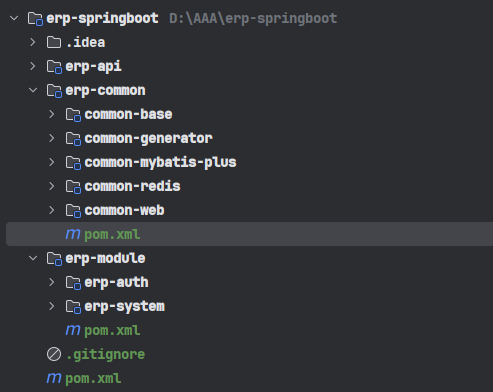
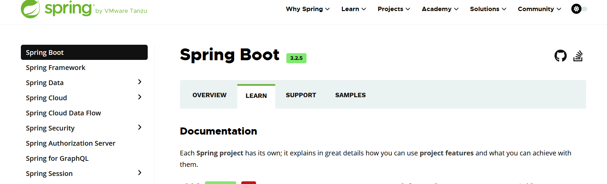
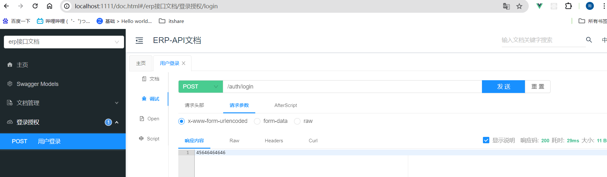

# 1. 初始化项目

## 1. 创建项目

按照这个结构创建项目目录



- erp-api：项目对外暴露的接口服务

- erp-common：公共组件，以及一些第三方插件整合

- erp-module: 业务模块，根据业务划分，通过不同的子模块进行开发，方便未来切分成微服务项目

  

## 2. 版本依赖添加

首先明确我们这个是一个基于 `springboot` 搭建的单体项目，既然是学习，我选择的是目前最新的稳定版本



我不会直接把所有的 `pom` 贴出来，我会从`0`开始，用到谁再添加谁，包括如何去组织依赖关系，我希望自己能够有一个清晰的认知，说白了就是，我希望自己的项目，自己对于每一个依赖都知道为什么添加以及为什么要添加在这。当然你也可以在我的 `gitee` 中获取所有的源码。

### 2.1 父工程确认版本

就目前阶段，我们只能确定我们想要的 `springboot` 版本，在父工程 `pom` 里添加依赖，那么该如何获取依赖坐标以及版本呢？当然是去官网查看，https://docs.spring.io/spring-boot/docs/current/reference/html/getting-started.html#getting-started

```xml
<?xml version="1.0" encoding="UTF-8"?>
<project xmlns="http://maven.apache.org/POM/4.0.0"
         xmlns:xsi="http://www.w3.org/2001/XMLSchema-instance"
         xsi:schemaLocation="http://maven.apache.org/POM/4.0.0 http://maven.apache.org/xsd/maven-4.0.0.xsd">
    <modelVersion>4.0.0</modelVersion>

    <groupId>com.thinkfon</groupId>
    <artifactId>erp-springboot</artifactId>
    <version>1.0-SNAPSHOT</version>
    
    <parent>
        <groupId>org.springframework.boot</groupId>
        <artifactId>spring-boot-starter-parent</artifactId>
        <version>3.2.5</version>
    </parent>

    <packaging>pom</packaging>
    <modules>
        <module>erp-api</module>
        <module>erp-common</module>
        <module>erp-module</module>
    </modules>

    <properties>
        <maven.compiler.source>17</maven.compiler.source>
        <maven.compiler.target>17</maven.compiler.target>
        <project.build.sourceEncoding>UTF-8</project.build.sourceEncoding>
    </properties>
    
    <dependencies>
        <dependency>
            <groupId>org.projectlombok</groupId>
            <artifactId>lombok</artifactId>
        </dependency>
    </dependencies>

</project>
```

> 父工程 `pom` 是建立在 `spring-boot-starter-parent` 下的，这么做的好处就是，所有 `spring` 官方支持的插件，我们后面使用都无需指定版本，而且也不大会出现版本冲突的问题。

`erp-api` 作为入口服务，我们先从这里开始，在`erp-api`的`pom.xml` 里添加 `web` 依赖，这样我们就可以写接口了。

```xml
<dependency>
    <groupId>org.springframework.boot</groupId>
    <artifactId>spring-boot-starter-web</artifactId>
</dependency>
```

### 2.2 公共服务版本确认

在我们开始写接口之前，需要做一些准备，为了后面写代码更加方便，磨刀不误砍柴工。

- 接口文档管理，swagger https://doc.xiaominfo.com/docs/quick-start#spring-boot-3

> 配置文档信息 
>
> ```java
> @Configuration
> @OpenAPIDefinition(info = @Info(
>         title = "ERP-API文档",  // 设置主页标题
>         description = "ERP所有模块接口文档大合集",  // 设置主页描述
>         version = "1.0.0",  // 设置API版本
>         contact = @Contact(
>                 name = "曹申阳",  // 设置作者名称
>                 url = "https://www.csyblog.cn",  // 设置作者URL
>                 email = "2417254000@qq.com"  // 设置作者邮箱
>         )
> ))
> public class SwaggerConfig {
> }
> ```
>
> 这里还有一个小坑， `favicon.icon` 报错，这个`knife4j`作者说其他公司说有干扰，给删了，但是这个是浏览器默认行为，还是会请求的，暂时办法就是在 `/resource/static` 下自己丢一个，后续再更进看看  https://github.com/xiaoymin/knife4j/issues/772

- 工具类，hutool https://doc.hutool.cn/
- jwt https://github.com/auth0/java-jwt

先在父工程中添加版本

```xml
<?xml version="1.0" encoding="UTF-8"?>
<project xmlns="http://maven.apache.org/POM/4.0.0"
         xmlns:xsi="http://www.w3.org/2001/XMLSchema-instance"
         xsi:schemaLocation="http://maven.apache.org/POM/4.0.0 http://maven.apache.org/xsd/maven-4.0.0.xsd">
    <modelVersion>4.0.0</modelVersion>

    <groupId>com.thinkfon</groupId>
    <artifactId>erp-springboot</artifactId>
    <version>1.0-SNAPSHOT</version>

    <parent>
        <groupId>org.springframework.boot</groupId>
        <artifactId>spring-boot-starter-parent</artifactId>
        <version>3.2.5</version>
    </parent>

    <packaging>pom</packaging>
    <modules>
        <module>erp-api</module>
        <module>erp-common</module>
        <module>erp-module</module>
    </modules>

    <properties>
        <maven.compiler.source>17</maven.compiler.source>
        <maven.compiler.target>17</maven.compiler.target>
        <project.build.sourceEncoding>UTF-8</project.build.sourceEncoding>
        <hutool.version>5.8.27</hutool.version>
        <knife4j.version>4.4.0</knife4j.version>
    </properties>

    <dependencyManagement>
        <dependencies>
            <!-- hutool 工具集 -->
            <dependency>
                <groupId>cn.hutool</groupId>
                <artifactId>hutool-all</artifactId>
                <version>${hutool.version}</version>
            </dependency>
            <!-- swagger相关依赖 -->
            <dependency>
                <groupId>com.github.xiaoymin</groupId>
                <artifactId>knife4j-openapi3-jakarta-spring-boot-starter</artifactId>
                <version>${knife4j.version}</version>
            </dependency>
        </dependencies>
    </dependencyManagement>

    <dependencies>
        <dependency>
            <groupId>org.projectlombok</groupId>
            <artifactId>lombok</artifactId>
        </dependency>
    </dependencies>

</project>

```

因为这些是基础工具，所以将这些抽取出来，放在`common-base`下，供其它项目使用。

`erp-api` 引入 `common-base` 

编写测试接口

```java
@Tag(name = "登录授权", description = "授权相关的接口")
@Slf4j
@RestController
@RequiredArgsConstructor
@RequestMapping("/auth")
public class LoginController {

    @Operation(summary = "用户登录", description = "用户登录返回token")
    @PostMapping("/login")
    public String login() {
        return "45646464646";
    }

}
```

配置 `application.yml` 

```yaml
# 开发环境配置
####### 端口配置 ########
server:
  port: 1111

####### 服务名称 ########
spring:
  application:
    name: erp-dev

```

> 到这里基本配置已经差不多了，我们可以写接口，然后通过`swagger`去调试




