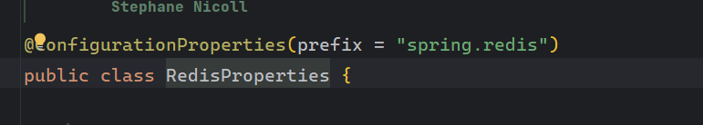

# 5. 整合SpringSecurity

官方文档：https://docs.spring.io/spring-security/reference/getting-spring-security.html

我将和鉴权有关的逻辑抽离出来，建立了子模块 `erp-auth` 依赖于 `erp-system`。

在 `erp-api` 中引入，`erp-auth` 基于 `SpringSecurity` 来实现登录认证的逻辑。

当我们正确引入依赖，启动项目时会看到控制台输出了默认密码


这表示一切正常，我们要基于这个完成自己的项目搭建。

## 1. 准备阶段，全局异常配置，定义统一返回类

我习惯从入口开始，也就是 controller -> service -> dao 来开始写业务，你可以按你喜欢的方式来

在开始之前，先定义统一返回类

```java
package com.thinkfon.erp.common.base.result;

import io.swagger.v3.oas.annotations.media.Schema;
import lombok.AllArgsConstructor;
import lombok.Builder;
import lombok.Data;
import lombok.NoArgsConstructor;
import lombok.experimental.Accessors;

import java.io.Serializable;

/**
 * <p>
 * 统一返回类
 * </p>
 *
 * @author 曹申阳
 * @since 2024-05-10 15:01:24
 */
@Data
@NoArgsConstructor
@AllArgsConstructor
@Builder
@Accessors(chain = true)
public class R<T> implements Serializable {

    @Schema(description = "返回业务请求状态码")
    private Integer code;

    @Schema(description = "返回消息描述")
    private String message;

    @Schema(description = "请求是否成功")
    private boolean success;

    @Schema(description = "返回对象数据")
    private T data;


    public R(ResponseCodeEnum responseCodeEnum) {
        this.code = responseCodeEnum.getCode();
        this.message = responseCodeEnum.getMessage();
    }

    public static <T> R<T> success(String message, T data) {
        R<T> response = new R<>(ResponseCodeEnum.SUCCESS);
        response.setSuccess(true);
        response.setData(data);
        response.setMessage(message);
        return response;
    }

    public static <T> R<T> success(String message) {
        R<T> response = new R<>(ResponseCodeEnum.SUCCESS);
        response.setSuccess(true);
        response.setData(null);
        response.setMessage(message);
        return response;
    }

    public static <T> R<T> success(T data) {
        R<T> response = new R<>(ResponseCodeEnum.SUCCESS);
        response.setSuccess(true);
        response.setData(data);
        return response;
    }


    public static <T> R<T> success() {
        R<T> response = new R<>(ResponseCodeEnum.SUCCESS);
        response.setSuccess(true);
        return response;
    }

    public static <T> R<T> failure() {
        R<T> response = new R<>(ResponseCodeEnum.FAIL);
        response.setData(null);
        response.setSuccess(false);
        return response;
    }

    public static <T> R<T> failure(String message) {
        R<T> response = new R<>(ResponseCodeEnum.FAIL);
        response.setData(null);
        response.setSuccess(false);
        response.setMessage(message);
        return response;
    }

    public static <T> R<T> failure(ResponseCodeEnum responseCodeEnum) {
        R<T> response = new R<>(responseCodeEnum);
        response.setData(null);
        response.setSuccess(false);
        return response;
    }
}

```

统一返回状态码,通过枚举类管理

```java
package com.thinkfon.erp.common.base.result;

import lombok.AllArgsConstructor;
import lombok.Getter;

/**
 * <p>
 * 统一状态码返回枚举
 * </p>
 *
 * @author 曹申阳
 * @since 2023-08-16 16:42:10
 */
@Getter
@AllArgsConstructor
public enum ResponseCodeEnum {

	/**
	 * 服务响应状态
	 */
	SUCCESS(20000,"请求成功"),
	FAIL(50000,"服务异常"),


	;

	private final int code;
	private final String message;
}

```

然后是我们的异常捕获，统一异常返回，因为这个`web`相关的，所以我将这个放在了 `common-web` 下

```java
package com.yang.common.web.exception;

import com.yang.common.base.result.ResponseCodeEnum;

/**
 * <p>
 *	erp系统异常
 * </p>
 *
 * @author 曹申阳
 * @since 2023-08-16 17:40:30
 */
public class ErpException extends RuntimeException {

	/**
	 * 错误码
	 */
	private final ResponseCodeEnum responseCode;

	public ErpException(ResponseCodeEnum code) {
		this.responseCode = code;
	}


	public ResponseCodeEnum getCode() {
		return responseCode;
	}

	@Override
	public String getMessage() {
		return responseCode.getMessage();
	}
}
```

```java
package com.yang.common.web.handler;

import com.yang.common.base.result.R;
import com.yang.common.base.result.ResponseCodeEnum;
import com.yang.common.web.exception.ErpException;
import lombok.extern.slf4j.Slf4j;
import org.springframework.validation.ObjectError;
import org.springframework.web.bind.MethodArgumentNotValidException;
import org.springframework.web.bind.annotation.ExceptionHandler;
import org.springframework.web.bind.annotation.RestControllerAdvice;
import org.springframework.security.access.AccessDeniedException;
import javax.servlet.http.HttpServletRequest;
import java.util.ArrayList;
import java.util.List;

/**
 * <p>
 * 全局异常捕获处理
 * </p>
 *
 * @author 曹申阳
 * @since 2023-08-16 17:41:46
 */
@Slf4j
@RestControllerAdvice
public class GlobalExceptionHandler {

    @ExceptionHandler(value = Exception.class)
    public R<String> handlerException(Exception e) {
        log.error("erp service has error [{}]", e.getMessage(), e);
        return R.failure(e.getMessage());
    }

    @ExceptionHandler(IllegalArgumentException.class)
    public <T> R<T> handleIllegalArgumentException(IllegalArgumentException e) {
        log.error("⾮法参数异常，异常原因：{}", e.getMessage(), e);
        return R.failure(e.getMessage());
    }

    /**
     * 处理参数校验异常
     */
    @ExceptionHandler(MethodArgumentNotValidException.class)
    public <T> R<T> errorHandler(MethodArgumentNotValidException e) {
        List<ObjectError> allErrors = e.getBindingResult().getAllErrors();
        List<String> messages = new ArrayList<>();
        allErrors.forEach(error -> messages.add(error.getDefaultMessage()));
        log.error("发生 MethodArgumentNotValidException 异常：{} ", messages);
        return R.failure(messages.toString());
    }

    @ExceptionHandler(value = ErpException.class)
    public R<String> handlerErpException(ErpException e) {
        log.error("erp service has error [{}]", e.getMessage(), e);
        return R.failure(e.getCode());
    }

    @ExceptionHandler(AccessDeniedException.class)
    public R<String> handleAccessDeniedException(AccessDeniedException e, HttpServletRequest request) {
        String requestURI = request.getRequestURI();
        log.error("请求地址'{}',权限校验失败'{}'", requestURI, e.getMessage());
        return R.failure(ResponseCodeEnum.ACCESS_DENIED);
    }
}

```

## 2. 基于SpringSecurity完成登录

接下来开始我们的开发，我们正常的逻辑应该是，前端输入用户名密码，请求后端，后端返回一个 `token`，前端通过 `token` 和后端请求数据，如果 `token` 失效或者不合法则提示错误。

创建 `LoginController` ，定义接口，随便返回一串字符，假设他是`token`, 如果请求成功了，那么我们只要再完善生成 `token` 的逻辑即可。

```java
@Tag(name = "登录授权", description = "授权相关的接口")
@Slf4j
@RestController
@RequiredArgsConstructor
@RequestMapping("/auth")
public class LoginController {

    @Operation(summary = "用户登录", description = "用户登录返回token")
    @PostMapping("/login")
    public String login() {
        return "45646464646";
    }

}
```

当我们想要打开 `swagger` 测试的时候发现，页面跳转了，需要我们登录，这正是 `spring security` 自动为我们添加的安全拦截，用户名为 `user`, 密码在控制台，当然我不是要让你使用用户名密码去访问，而是我们接下来的第一步应该是，过滤掉这些，我们不需要它拦截的 `url`


详细参考官方文档：https://docs.spring.io/spring-security/reference/servlet/authentication/passwords/index.html#servlet-authentication-unpwd

这个和之前的版本不太一样，但是参考官网，也不难看懂

```java
package com.thinkfon.erp.auth.config;

import org.springframework.context.annotation.Bean;
import org.springframework.context.annotation.Configuration;
import org.springframework.security.config.Customizer;
import org.springframework.security.config.annotation.web.builders.HttpSecurity;
import org.springframework.security.config.annotation.web.configuration.EnableWebSecurity;
import org.springframework.security.config.annotation.web.configurers.AbstractHttpConfigurer;
import org.springframework.security.config.http.SessionCreationPolicy;
import org.springframework.security.web.SecurityFilterChain;

/**
 * <p>
 * Security配置类
 * </p>
 *
 * @author 曹申阳
 * @since 2024-05-10 15:21:08
 */
@Configuration
@EnableWebSecurity
public class SecurityConfig {

    String[] whitelist = {
            "/doc.html",
            "/swagger-resources/**",
            "/v3/api-docs/**",
            "/webjars/**",
            "/favicon.ico",
            "/setting/initialize",
             "/auth/login"
    };
    @Bean
    public SecurityFilterChain securityFilterChain(HttpSecurity http) throws Exception {
        http
                .authorizeHttpRequests((authorize) -> authorize
                        .requestMatchers(whitelist).permitAll()
                         .anyRequest().authenticated()
                )
                .csrf(AbstractHttpConfigurer::disable)
                .sessionManagement((session) -> session.sessionCreationPolicy(SessionCreationPolicy.STATELESS));

        return http.build();
    }
}
```

这个时候发现，可以正常访问 `swagger` 发出登录请求了

接下来实现我们自己的生成`token`逻辑

这里依然是走的默认鉴权，我们需要定义自己的实现 `SystemUserDataServiceImpl`,这里代码就不贴出来了，可以看源码，思路就是根据用户名密码查出用户信息，最后拼装成 `UserDetails` 对象 

配置自定义认证对象 `SystemUserDetails`

先写一个初始化管理员账户的接口，不然数据库里都是空的，没法测试。

这里会用到 `redis` 引入 `redis`

配置 `redis` 工具类，添加 `redis`配置，这里有个小坑，这个版本`redis` 配置坐标变了




根据你的版本来配置

编写 `jwtUtil` 工具类

添加 JSR380 校验

配置跨域

```java
@Configuration
public class WebMvcConfig implements WebMvcConfigurer {

    @Override
    public void addCorsMappings(CorsRegistry registry) {
        registry.addMapping("/**")
                .allowedOrigins("*") // 允许所有来源的请求
                .allowedMethods("GET", "POST", "PUT", "DELETE") // 允许的请求方法
                .allowCredentials(true) // 允许发送 Cookie
                .maxAge(3600); // 预检请求的缓存时间，单位秒
    }
}
```


