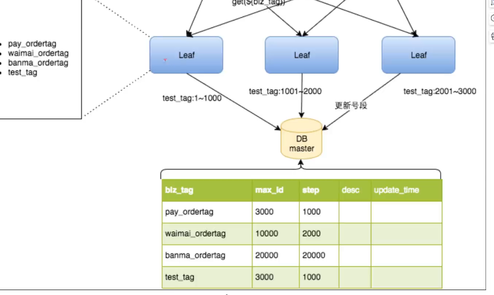
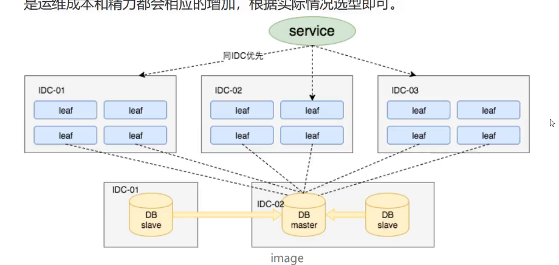
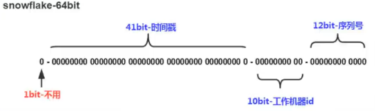

## 主键生成策略

## 1. UUID

- 占用存储空间较大

- 完全随机，不是自增的，不利于数据库查询

> 不建议使用

## 2. 数据库自增ID

- 占用空间小
- 自增，查询效率高
- 但是不利于分库分表，我们可以通过抽离出一张表维护主键ID，完成分库分表，但是三高场景下，维护主键ID表的压力会很大，会成为系统性能瓶颈。可以通过设置不同步长，将维护主键的表拆分，来进行拆分。无论是那种方式，后续更改代价都很大。
- 容易暴露规律，被窃取，比如接口获取数据 /product/{1}，那么很容易通过工具批量请求。

> 小规模项目，数据量不大，并发不高时可以使用


美团 `leaf` 自增ID




每次从数据库取一个区间的ID值，然后通过程序，也就是 `leaf` 服务在这个区间内递增，这样减少了与数据库的交互，从而提高了并发。

- `leaf` 服务可以很方便的线性扩展，性能可以支持大多数业务场景

- ID号码是趋势递增的 `8 byte` 的 `64`位数字，满足数据库存储主键的要求

- `leaf` 服务内部有号段缓存，即使`DB`宕机，短时间内 `leaf` 服务然能正常服务。
- 可以设置 `max_id`, 方便迁移

双 `buffer` 优化，保证 `leaf` 服务一直有可用的`ID`段，避免当无`ID`可用的时候，调用服务等待时间过程

## 3. Redis



## 4. 雪花算法 Snowflake



```java
package com.thinkfon.common.base.utils;

/**
 * <p>
 * 生成雪花ID
 * </p>
 *
 * @author 曹申阳
 * @since 2024-05-09 14:33:48
 */
public class SnowflakeIdWorker {

    private final static long START_STAMP = 1715239559167L; // 起始的时间戳
    private final static long SEQUENCE_BIT = 12L; // 序列号位数
    /**
     * 工作机器ID位数 10
     */
    private final static long MACHINE_BIT = 5L;   // 机器标识占用的位数
    private final static long DATACENTER_BIT = 5L;// 数据中心占用的位数


    private final static long MAX_DATACENTER_NUM = ~(-1L << DATACENTER_BIT); // 最大序列号
    private final static long MAX_MACHINE_NUM = ~(-1L << MACHINE_BIT); // 最大机器序号
    private final static long MAX_SEQUENCE = ~(-1L << SEQUENCE_BIT);   // 最大数据中心序号

    /**
     * 每一部分向左的位移
     */
    private final static long MACHINE_LEFT = SEQUENCE_BIT;
    private final static long DATACENTER_LEFT = SEQUENCE_BIT + MACHINE_BIT;
    private final static long TIMESTAMP_LEFT = DATACENTER_LEFT + DATACENTER_BIT;

    private final long dataCenterId;  // 数据中心
    private final long machineId;     // 机器标识
    private long sequence = 0L; // 序列号
    private long lastStamp = -1L; // 上一次时间戳

    public SnowflakeIdWorker(long dataCenterId, long machineId) {
        if (dataCenterId > MAX_DATACENTER_NUM || dataCenterId < 0) {
            throw new IllegalArgumentException("datacenterId can't be greater than MAX_DATACENTER_NUM or less than 0");
        }
        if (machineId > MAX_MACHINE_NUM || machineId < 0) {
            throw new IllegalArgumentException("machineId can't be greater than MAX_MACHINE_NUM or less than 0");
        }
        this.dataCenterId = dataCenterId;
        this.machineId = machineId;
    }

    /**
     * 产生下一个ID
     *
     * @return  long
     */
    public synchronized long nextId() {
        long currStamp = System.currentTimeMillis();
        if (currStamp < lastStamp) {
            throw new RuntimeException("Clock moved backwards.  Refusing to generate id");
        }

        if (currStamp == lastStamp) {
            //相同毫秒内，序列号自增
            sequence = (sequence + 1) & MAX_SEQUENCE;
            //同一毫秒的序列数已经达到最大
            if (sequence == 0L) {
                currStamp = getNextMill();
            }
        } else {
            //不同毫秒内，序列号置为0
            sequence = 0L;
        }
        lastStamp = currStamp;
        return (currStamp - START_STAMP) << TIMESTAMP_LEFT //时间戳部分左移 22 位
                | dataCenterId << DATACENTER_LEFT       //数据中心部分左移 17 位
                | machineId << MACHINE_LEFT             //机器标识部分左移 12 位
                | sequence;                             //序列号部分
    }

    /**
     * 阻塞到下一个毫秒，知道获得新的时间戳
     * @return long
     */
    private long getNextMill() {
        long mill = System.currentTimeMillis();
        while (mill <= lastStamp) {
            mill = System.currentTimeMillis();
        }
        return mill;
    }


    public static void main(String[] args) {
        SnowflakeIdWorker snowFlake = new SnowflakeIdWorker(2, 3);
        System.out.println(System.currentTimeMillis());
        for (int i = 0; i < 11; i++) {
            System.out.println(snowFlake.nextId());
        }

    }
}
```

解决时钟回拨问题，简单理解就是当服务器的时间出现倒退的情况，比如现在的系统时间是 2024-05-09 12:00:00 ，但是由于某些原因导致系统时间变成了，2024-05-08 11:00:00，那么就会导致雪花算法生成的ID错误。可能会导致回拨的原因有很多种，下面列出收集到的

- **硬件故障：** 服务器或网络设备的硬件故障可能会导致时钟回拨。例如，电池电源故障可能导致系统时钟重新初始化，导致时钟回拨。
- **操作系统问题：** 操作系统中的软件 bug 或者配置问题可能会导致时钟回拨。例如，操作系统内核更新时出现的问题、时钟同步服务异常等。
- **虚拟化环境：** 在虚拟化环境中，时钟回拨可能会由于宿主机与虚拟机之间的时钟同步问题引起。虚拟机在不同的宿主机上迁移或者恢复时也可能会导致时钟回拨。
- **网络延迟：** 网络延迟可能会导致时钟同步服务无法及时更新系统时钟，从而导致时钟回拨。
- **时间同步服务问题：** 使用时间同步服务（如NTP）来同步系统时钟时，如果服务配置不正确或者服务本身出现故障，可能会导致时钟回拨。

**如何解决**

- 直接抛异常，恢复时钟后恢复。无关紧要的项目中使用，公司项目不可使用
- 设置不同阈值，针对不同阈值做处理
  - 回拨时间比较小，可以睡眠等待时钟恢复
  - 时间一般，可以通过备份机，我们将上一次的ID缓存，如果出现回拨，使用上一次ID作为基准，递增
  - 差距很大，可以换机器，但是单体项目中，不适用。