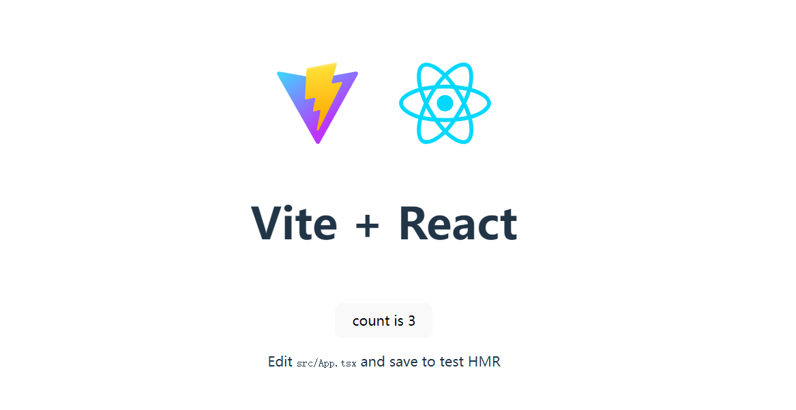
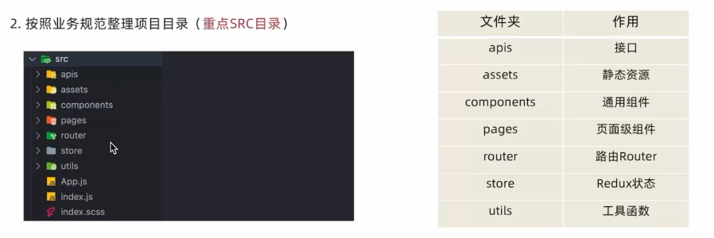
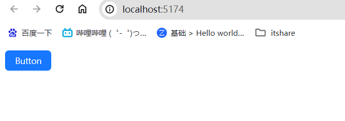
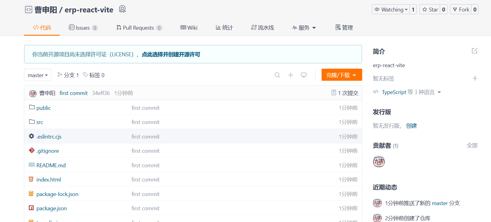

# 01.项目搭建

关于 Vite 我就不深入去了解了，就是个构建工具，现阶段我还涉及不到内部细节。https://cn.vitejs.dev/guide/

## 1. 搭建第一个Vite项目

:::warning

兼容性注意

Vite 需要 [Node.js](https://nodejs.org/en/) 版本 18+，20+。然而，有些模板需要依赖更高的 Node 版本才能正常运行，当你的包管理器发出警告时，请注意升级你的 Node 版本。

:::


```bash
npm create vite@latest
```


这里我选择了 `React` + `TypeScript`，不想用的可以换成 `Javascript`

执行完毕后，使用 `vscode` 打开项目

**安装依赖**

```bash
npm install

```

**启动项目**

```bash
npm run dev
```

> 看到下面界面表示初始搭建完成




## 2. 完善项目目录结构



## 3. 引入 sass 依赖

```bash
npm install sass -D
```

## 4. 整合 Ant Design

>官方文档地址：https://ant-design.antgroup.com/index-cn


文档介绍的很详细，包括在 `Vite`中如何使用，https://ant-design.antgroup.com/docs/react/use-with-vite-cn

- **安装依赖**

```bash
npm install antd --save
```

- 修改 `src/app.tsx`, 引入 `antd` 的按钮组件

  ```tsx
  import { Button } from 'antd'
  
  function App() {
    return (
      <>
        <Button type="primary">Button</Button>
      </>
    )
  }
  
  export default App
  ```

  




## 5. 配置路由

> 官方文档地址：https://reactrouter.com/en/main/start/tutorial

- 安装路由包

```bash
npm install react-router-dom
```

- 准备两个基础路由
- 引入组件进行路由配置
- 在入口文件中渲染`<RouterProvider/>`, 传入 `router` 实例

## 6. 配置@别名路径

因为我使用的是 `vite` 构建的项目，所以查看 `vite` 官方文档添加相关配置

```bash
import { fileURLToPath, URL } from 'node:url'
// https://vitejs.dev/config/
export default defineConfig({
  plugins: [react()],
  resolve: {
    alias: {
      '@': fileURLToPath(new URL('./src', import.meta.url)),
    },
  },
})
```

测试配置是生效了，但是`ts`检测爆红，并且输入@的时候没有路径提示

在 `tsconfig.json` 里添加配置

```diff
"compilerOptions": {
    ......
    /* alias */ // [!code ++]
    "baseUrl": ".", // [!code ++]
    "paths": { // [!code ++]
      "@/*": ["./src/*"]// [!code ++]
    } // [!code ++]
 },
```

## 7. 整合 tailwindcss

官网地址：https://www.tailwindcss.cn/

官网介绍的很详细，大家可以在这里选择自己的框架 https://www.tailwindcss.cn/docs/installation/framework-guides

我使用的是 `vite` `Using React` https://www.tailwindcss.cn/docs/guides/vite#react

```bash
npm install -D tailwindcss postcss autoprefixer
```

```bash
npx tailwindcss init -p
```

修改 `tailwind.config.js`配置

```js
/** @type {import('tailwindcss').Config} */
export default {
  content: [
    "./index.html",// [!code ++]
    "./src/**/*.{js,ts,jsx,tsx}", // [!code ++]
  ],
  theme: {
    extend: {},
  },
  plugins: [],
}
```

添加基础指令 `index.css`

```js
@tailwind base;
@tailwind components;
@tailwind utilities;
```

> 解决编辑器警告，在`.vscode/settings.json` 中添加以下配置，如果没有这个文件，新建即可
>
> ```json
> {
>   "css.lint.unknownAtRules": "ignore"
> }
> ```

然后就可以直接使用了

```tsx
export default function App() {
  return (
    <h1 className="text-3xl font-bold underline">
      Hello world!
    </h1>
  )
}
```


## 8. 使用 gitee 管理项目

- 创建仓库
- 将本地仓库与远程仓库建立关联

```bash
git init
git add .
git commit -m "first commit"
git remote add origin https://gitee.com/cao-shen-yang/erp-react-vite.git
git push -u origin "master"
```




## 9. 配置 editorconfig

官方文档：https://editorconfig.org/

## 10. 配置 prettier

官方文档：https://prettier.io/  https://www.prettier.cn/

```bash
npm install --save-dev --save-exact prettier
```