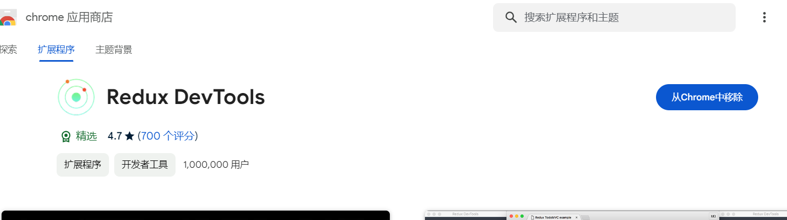
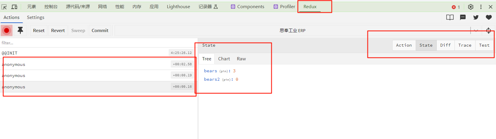

# 04.Zustand状态管理

当我需要管理 `token`，或者说一些状态值的时候，首先想到的是，相对于 `Vue` 的 `Vuex` 和 `Pinia` ，那么像 `React` 这么成熟的框架，肯定也有现成的，了解下来发现果然，`React` 常用的有 `Redux`, 和 风头正盛的 `Zustand` , 和 `Vue` 生态极为相似，`Redux` 就好比 `Vuex` ，作为老大哥，强大可靠，在当今时局下显得过重。而 `Zustand` 则和 `Pinia` 一样，更为轻巧，更贴合未来技术发展趋势，使用的人也越来越多，对于我这个小白来说，我果断选择了轻巧简便的 `Zustand` 作为这个项目的状态管理库。

官网地址：https://docs.pmnd.rs/zustand/getting-started/introduction

## 1. 安装依赖

```bash
npm install zustand
```

## 2. 创建 store

```typescript
import { create } from 'zustand'
import { immer } from 'zustand/middleware/immer'

type BearStore = {
  bears: number
  increasePopulation: () => void
  removeAllBears: () => void
  updateBears: (newBears: number) => void
}

export const useBearStore = create<BearStore>()(
  immer((set) => ({
    bears: 0,
    increasePopulation: () => set((state) => ({ bears: state.bears + 1 })),
    removeAllBears: () => set({ bears: 0 }),
    updateBears: (newBears) => set({ bears: newBears }),
  }))
)
```

>使用 `set` 函数修改 `state` 中的值

## 3. 使用 store

```tsx
import { useBearStore } from '@/store'
import { Button } from 'antd'
import React from 'react'

const BearBox: React.FC = () => {
  const bears = useBearStore((state) => state.bears)
  const increasePopulation = useBearStore((state) => state.increasePopulation)
  const removeAllBears = useBearStore((state) => state.removeAllBears)

  return (
    <div>
      <p>bears:{bears}</p>
      <Button onClick={increasePopulation}>add</Button>
      <Button onClick={removeAllBears}>remove</Button>
    </div>
  )
}

export default BearBox
```

## 4. 使用 immer 中间件更新深度嵌套的状态

先安装依赖

```bash
npm install immer
```

使用 `immer` 对整个 `function` 进行包裹

```typescript
export const useBearStore = create<BearStore>()(
  immer((set) => ({
    bears: 0,
    increasePopulation: () =>
      set((state) => {
        state.bears++
      }),
    removeAllBears: () => set({ bears: 0 }),
  }))
)
```

> `set` 方法可以直接操作 `state` 里的状态


## 5. 使用 selector 

> 避免重渲染问题

这种方式当状态多了的时候就比较繁琐，但是好在，用谁就选择谁，除了写起来麻烦点，我认为没什么大毛病

```typescript
const bears = useBearStore((state) => state.bears)
const increasePopulation = useBearStore((state) => state.increasePopulation)
const removeAllBears = useBearStore((state) => state.removeAllBears)
```

还有一种偷懒的写法

```typescript
 const { bears, increasePopulation, removeAllBears } = useCatStore()
```

这种写法就比上面要简练多了，但是这种写法会导致重渲染的问题，当状态值过多的时候就会影响速度。

如果 `state` 里有2个状态 `bears` 和 `bears2` ，第二种写法，即使我们没有使用到 `bears` 依然会进行重新渲染。所以为了性能，我们应该使用 `selector` 来使用 `state`

好在作者提供了一个自动生成选择器的方法：https://docs.pmnd.rs/zustand/guides/auto-generating-selectors

- 新建一个方法 `createSelectors.ts`

```typescript
import { StoreApi, UseBoundStore } from 'zustand'

type WithSelectors<S> = S extends { getState: () => infer T } ? S & { use: { [K in keyof T]: () => T[K] } } : never

export const createSelectors = <S extends UseBoundStore<StoreApi<object>>>(_store: S) => {
  const store = _store as WithSelectors<typeof _store>
  store.use = {}
  for (const k of Object.keys(store.getState())) {
    // eslint-disable-next-line @typescript-eslint/no-explicit-any
    (store.use as any)[k] = () => store((s) => s[k as keyof typeof s])
  }

  return store
}

```

- 创建`store`进行包裹

```typescript
export const useBearStore = createSelectors(
  create<BearStore>()(
    immer((set) => ({
      bears: 0,
      bears2: 0,
      increasePopulation: () =>
        set((state) => {
          state.bears++
        }),
      removeAllBears: () => set({ bears: 0 }),
    }))
  )
)
```

- 组件中使用

```typescript
const bears = useBearStore.use.bears()
const increasePopulation = useBearStore.use.increasePopulation()
const removeAllBears = useBearStore.use.removeAllBears()
```

> 上面示例中，我们通过作者提供的方法，通过 `use` 自动生成对于的选择器，返回我们想要的 state，简化了代码编写，但是我们依然只能一个一个的选择，那么如何一次性选择多个呢？

使用 `useShallow` https://docs.pmnd.rs/zustand/guides/prevent-rerenders-with-use-shallow

```tsx
 const { increasePopulation, removeAllBears } = useBearStore(
    useShallow((state) => ({
      increasePopulation: state.increasePopulation,
      removeAllBears: state.removeAllBears,
    }))
  )
```

## 6. 使用 devtools

安装插件，chrome 应用商店下载



使用 `devtools` 包裹

```typescript
export const useBearStore = createSelectors(
  create<BearStore>()(
    immer(devtools((set) => ({
      bears: 0,
      bears2: 0,
      increasePopulation: () =>
        set((state) => {
          state.bears++
        }),
      removeAllBears: () => set({ bears: 0 }),
    })))
  )
)
```

> 注意这里要把这个包裹放在 `immer` 里面

控制台观察




## 7. 使用 Persist 持久化

官方文档：https://docs.pmnd.rs/zustand/integrations/persisting-store-data

默认保存在 `localStorage`

使用 `persist` 包裹

可以定义名称，以及存储位置

支持部分`state`持久化

> 注意包裹顺序，要在 `devtools` 后面

## 8. reactive 和 subscribe

使用之前的 `selector` 取出来的状态为 `reactive` 的，当值发生改变，使用的组件会立马感知到并且会重新渲染页面，而 `subscribe` 的则是订阅全局状态，但不会重渲染。

```typescript
useEffect(() => {
    const noSub = useBearStore.subscribe((state, preState) => {
        console.log(state, preState)
    })
    return noSub
})
```

上面这个会订阅所有的状态，如果只想订阅指定的，就需要使用到一个中间件 `subscribeWithSelector`

使用方法和其它中间件一样，使用 `subscribeWithSelector` 包裹，使用和全局基本一样，只是第一个参数变成了，选择器，选择我们订阅的状态，第二个参数和原先一样，第三个参数是一个 `options` 

```typescript
{
   equalityFn: shallow // 和上面提到useShallow的作用一样，可以减少重渲染
   fireImmediately: false, // 组件初始化时是不是立即执行
}

```

> 注意，包裹的顺序，`devtools` 和 `persist` 中间

## 9. getState() 和 setState()

在 `store` 外面修改 `state` 

`getState()` 获取到的状态是`no-reactive` 的

可以利用这个将 `store` 里的方法分离出来，这样 `store` 里只维护状态值，代码就会很清爽了。

https://docs.pmnd.rs/zustand/guides/practice-with-no-store-actions

## 10. 总结

以上都是学习过程，那么在实际项目中我们应该如何使用，接下来是我觉得最舒服的使用姿势

首先，安装依赖，基本整合这都一样没什么特别的，接下来就是如何规划我们的 `store`, 我倾向于创建多个分开的  `store` 各司其职，这样管理起来比较方便，缺点也很明显，需要维护很多个 `store` 文件，但是我觉得状态管理，首先不会涉及到很多，其次合理的命名也不会给我们维护带来太大的负担。

```typescript
import { createSelectors } from '@/utils/createSelectors'
import { create } from 'zustand'
import { devtools, persist } from 'zustand/middleware'
import { immer } from 'zustand/middleware/immer'

const initialUserInfoValue = {
  token: '',
}

export const useBearStore = createSelectors(
  create<typeof initialUserInfoValue>()(
    immer(devtools(persist(() => initialUserInfoValue, { name: 'user-info-storage' })))
  )
)

/**
 * 设置 token
 * @param token 
 */
export const setToken = (token: string) => {
  useBearStore.setState((state) => {
    state.token = token
  })
}

/**
 * 重置用户信息
 */
export const resetUserInfo = () => {
  useBearStore.setState((state) => {
    state.token = ''
  })
}

```

按照这种方式，可以看到代码还是很清晰的


