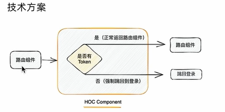

# 05.路由守卫高阶组件




```tsx
// 封装高阶组件
// 核心逻辑：有 token 正常跳转，无 token 跳转到登录页
import { useUserInfoStore } from '@/store/userInfo'
import { Navigate } from 'react-router-dom'

export function AuthRoute({ children }: { children: React.ReactNode }) {
  const token = useUserInfoStore.getState().token
  if (!token) {
    return <Navigate to="/login" replace />
  } else {
    return <>{children}</>
  }
}

```

```typescript
// 路由配置
import { createBrowserRouter } from 'react-router-dom'
import Login from '@/pages/Login'
import Layout from '@/pages/Layout'
import { AuthRoute } from '@/components/AuthRoute'

const router = createBrowserRouter([
  { path: '/login', element: <Login /> },
  {
    path: '/',
    element: (
      <AuthRoute>
        <Layout />
      </AuthRoute>
    ),
  },
])

export default router

```

