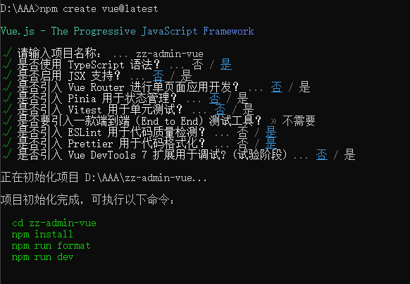
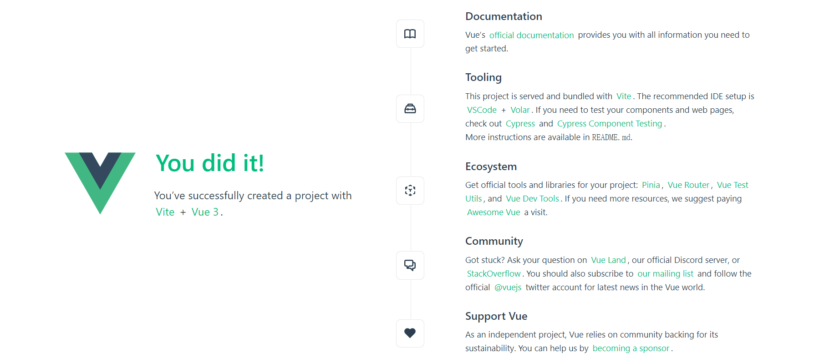
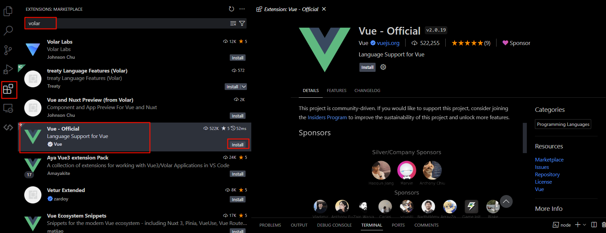
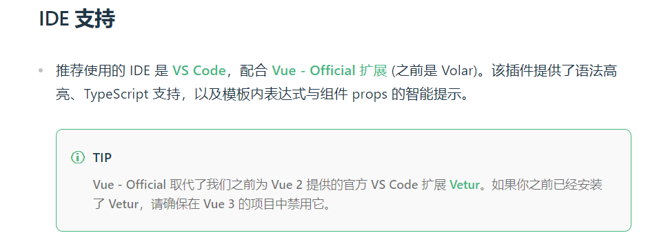
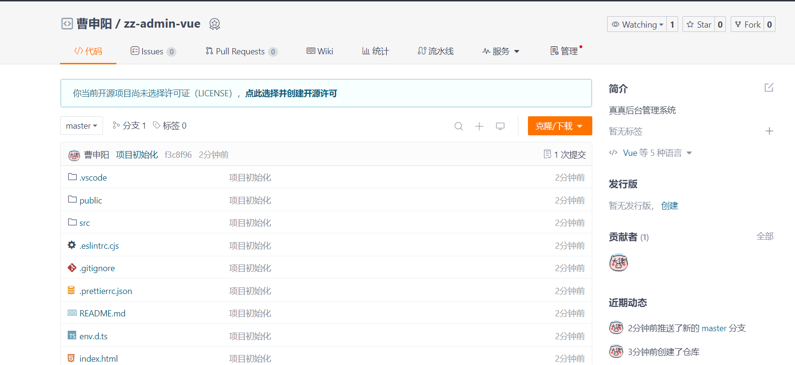
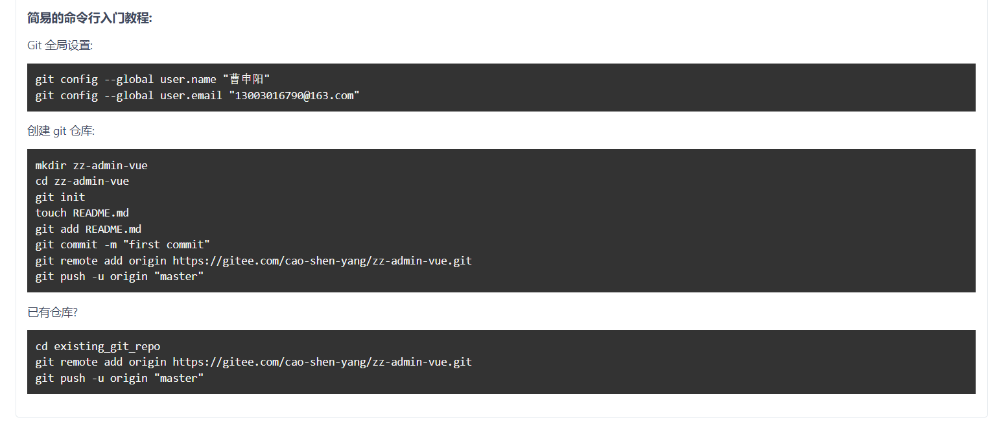

# 01.项目初始化

::: tip

截至目前时间 **2024.5.17**，参考官方文档创建项目，这里只记录当前版本的创建过程，如果版本出入较大，还请参考官方最新文档。

官网地址：https://cn.vuejs.org/guide/quick-start.html

:::

## 1. 创建项目

```bash
npm create vue@latest
```



这样项目就创建好了，按照上面的命令执行，看到如下页面表示项目启动成功。

::: tip

这里有个小技巧，使用 `code` 命令快速打开 `vscode`，执行 `code zz-admin-vue` 可快速用 `vscode` 打开该项目。

:::

安装依赖，启动项目

```bash
npm install
```

```bash
npm run dev
```




## 2. IDE 支持

::: tip

在我重新整理笔记的时候，`volar` 已经更名为 `Vue-Official`，我是直接安装新的

:::



其实文档里也早就有介绍过 https://cn.vuejs.org/guide/scaling-up/tooling.html#ide-support



## 3. Git代码管理

::: warning

这里的前提条件是本地已经正确安装好了 **git** 工具

:::

为了方便管理，以及版本信息记录。将代码托管至码云上，具体操作也可参这篇文章：https://juejin.cn/post/7032976688887627790

### 3.1 注册账号，创建仓库

这个比较简单，不做赘述。

### 3.2 将本地仓库同步到远程仓库

- **在当前项目目录下打开 git bash 操作窗口**
- **按顺序执行以下命令**

```bash
git init 
git add .
git commit -m "项目初始化"
git remote add origin xxx这里换成你的代码仓库地址xxxxx
git push -u origin "master"
```

- **查看码云提交记录，是否提交成功**



这个步骤官方其实会提示，但是如果创建项目的时候你选择了生成一些默认配置，就会直接跳过这个页面

