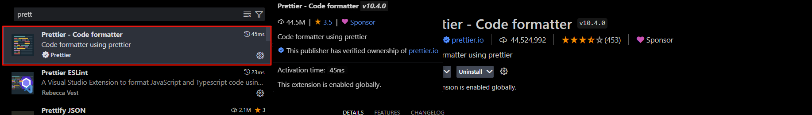
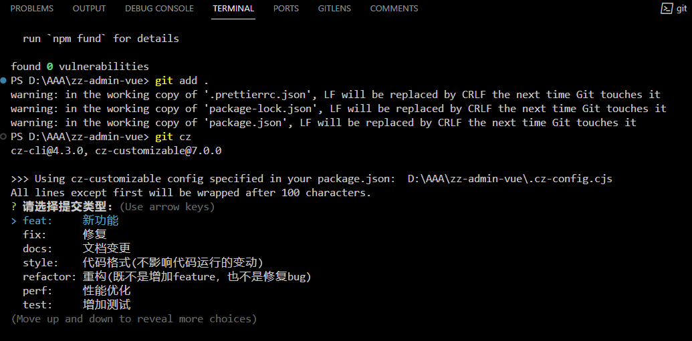
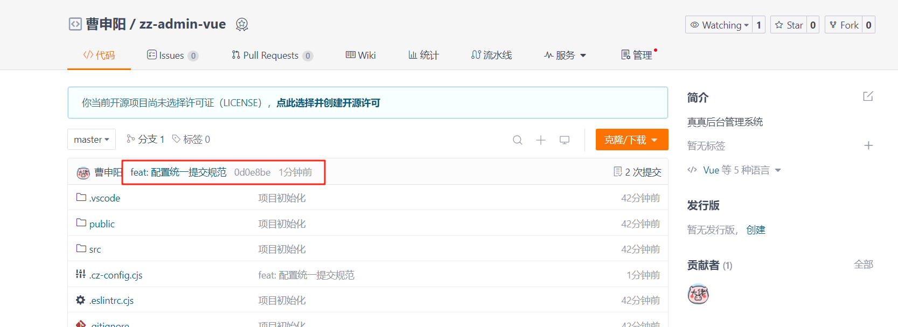
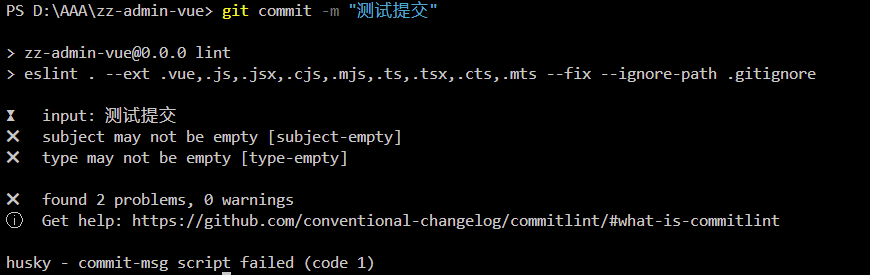
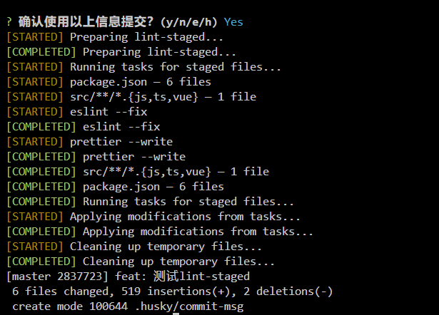

# 02.标准化编程规范

## 1. 前言

在日常开发中，随着团队人员的变更，功能迭代，如果没有一套规范约束大家，就会导致项目中的代码充斥着各种代码风格，会导致后期维护起来十分困难，所以有必要去制定一套规范。互联网发展到今天，前辈们自然也想到了这点，所以有很多已经很完善的方案，这里我只介绍 **ESlint + Prettier + commitizen + commitlint + lint-staged。**

其实我认为养好良好的编程习惯很重要，而且应该定期开展 **code review** ，否则哪怕再完善的配置，最终也会导致项目变成“屎山”，包括 **TS** 都是为了项目易于维护，如果自己写项目，我不会加这些配置，影响开发效率，但是为了学习，这个项目我会加上这些配置以及使用 **TS**

这里我不想过多介绍，因为我认为这些来约束人的东西不是必要的，如果想要配置，可以跟着操作即可，也很简单。个人项目或者不太在意的直接跳过就行。


## 2. 编程规范

### 2.1. 代码检测工具 ESLint

这个初始化项目的时候，我就选择安装了，如果你和我选的一样应该是装上的，不过多介绍。想要进一步了解可参考官网 https://eslint.org/ 中文地址：https://zh-hans.eslint.org/。

我认为默认的规则就比较合理，如果想要修改默认规则可以在 **.eslintrc.cjs** 文件中进行修改，比如默认规则要求 `vue` 组件名称必须要由多个单词组成，否则会有提示，如果想要修改可以这样修改：

```js
module.exports = {
  ...
  ...
  /**
   * 错误级别分为三种：
   * "off" 或 0 - 关闭规则
   * "warn" 或 1 - 开启规则，使用警告级别的错误：warn (不会导致程序退出)
   * "error" 或 2 - 开启规则，使用错误级别的错误：error (当被触发的时候，程序会退出)
   */
  rules: { // [!code ++]
    'vue/multi-word-component-names': 0 // [!code ++]
  } // [!code ++]
}

```

使用 **npm run lint** 可以检测编程规范，根据提示可以快速定位到问题代码。

### 2.2. 代码格式化工具 Prettier

这个在创建的时候，已经选择安装了， 这是一款开箱即用的代码格式化插件，可以直接通过 **VSCode** 安装整合。想要进一步了解，请参考官网：https://prettier.io/ 中文地址: https://www.prettier.cn/



如果想要修改代码风格，比如缩进，换行等等，可以看到一个 **.prettierrc.json** 的配置文件，这里可以配置我们统一的代码风格:  

```json
{
  "$schema": "https://json.schemastore.org/prettierrc",
  // 不使用尾行分号
  "semi": false,
  // tab键等于2个空格
  "tabWidth": 2,
  // 使用单引号
  "singleQuote": true,
  // 每行最大字符宽度，换行临界值
  "printWidth": 100,
  // 多行逗号分隔语法中，最后一行不加逗号
  "trailingComma": "none"
}
```

使用 **npm run format**  命令自动检测代码格式规范，会应用配置自动进行代码格式化 

::: warning

这里有的时候会出现与预期不符的情况，有可能是 **VSCode** 设置与配置项有冲突，可以修改配置或 **VSCode** 环境配置，使他们保持一致。以前我们习惯将 **ESLint** 和 **Prettier** 整合到了一起，让语法校验的同时进行代码的格式化，但是从 **ESLint** 和 **VUE3** 提供的脚手架工程默认配置 **.eslintrc.cjs** 可以看出（@vue/eslint-config-prettier/skip-formatting），**ESLint** 的主要要任务应该是语法的校验，而格式化的工作交给了 **Prettier**, 各司其职。如果最后还是出现爆红或者检测异常，尝试重启一下项目。

:::

## 3. 代码提交规范

避免团队合作时大家提交信息乱写，不利于问题追溯， 现在市面上比较广泛应用的应该是 [Angular 团队规范](https://github.com/angular/angular.js/blob/master/DEVELOPERS.md#-git-commit-guidelines) 延伸出的 [Conventional Commits specification（约定式提交）](https://www.conventionalcommits.org/zh-hans/v1.0.0/)。想要进一步了解，可查阅官方网站。用的比较多的应该就是 **feat** 和 **fix**  

### 3.1. 使用 Commintzen 规范化提交代码

#### 3.1.1. 全局安装Commitizen

想进一步了解可参考官方：https://github.com/commitizen/cz-cli

```bash
npm install -g commitizen
```

#### 3.1.2. 安装并配置 cz-customizable

官方地址：https://github.com/leoforfree/cz-customizable

- 安装依赖

```bash
npm i cz-customizable --save-dev
```

- 在 `package.json` 中添加以下配置  

```json
{
    ...
    "config": {
        "commitizen": {
            "path": "node_modules/cz-customizable"
        }
    },
}

```

#### 3.1.3. 在项目根目录下创建 .cz-config.cjs 自定义提示文件

```js
module.exports = {
  // 可选类型
  types: [
    { value: 'feat', name: 'feat:     新功能' },
    { value: 'fix', name: 'fix:      修复' },
    { value: 'docs', name: 'docs:     文档变更' },
    { value: 'style', name: 'style:    代码格式(不影响代码运行的变动)' },
    { value: 'refactor', name: 'refactor: 重构(既不是增加feature，也不是修复bug)' },
    { value: 'perf', name: 'perf:     性能优化' },
    { value: 'test', name: 'test:     增加测试' },
    { value: 'chore', name: 'chore:    构建过程或辅助工具的变动' },
    { value: 'revert', name: 'revert:   回退' },
    { value: 'build', name: 'build:    打包' }
  ],
  // portal 门户，system 后台管理系统
  scopes: ['', 'portal', 'system'],
  // 消息步骤
  messages: {
    type: '请选择提交类型:',
    customScope: '请输入修改范围(可选):',
    subject: '请简要描述提交(必填):',
    body: '请输入详细描述(可选):',
    footer: '请输入要关闭的issue(可选):',
    confirmCommit: '确认使用以上信息提交？(y/n/e/h)'
  },
  // 跳过问题
  skipQuestions: ['body', 'footer'],
  // subject文字长度默认是72
  subjectLimit: 200
}

```

::: danger

在 `package.json` 添加以下配置, 否则会提示错误

```json
"config": {
    "cz-customizable": {
        "config": ".cz-config.cjs"
    }
}
```

:::

#### 3.1.4. 使用 git cz 代替 git commit

测试一下提交



可以看到配置生效了，选择填写提交信息后 `git push`



:::tip

这里还可以指定 **customScope** 修改范围，默认为 **customer**，我不喜欢，如果未指定则不要给我显示 修改配置 **.cz-config.js**，添加自定义的范围，可根据自己项目情况添加，比如我是按照门户网站和管理系统来区分的，选择空字符串则不会有修改范围。  

```js
{
  ......
  scopes: ['', 'system', 'portal'],
}
```

:::

### 3.2. 使用 husky + commitlint 检查提交是否规范

我们使用 `git cz` 代替 `git commit` 实现了规范化的提交，但是无法避免有的时候忘记，习惯性使用 `git commit` 提交，这个时候我们就需要添加一层校验，来规避这种情况  

#### 3.2.1. 认识 Git Hooks

无论我们怎么变着花的提交代码，最终的执行命令都是 **git** 工具完成的，而 **git** 支持在执行某个事件之前或者之后进行一些其他的额外操作，为我们提供了很多事先就定义好的 **钩子函数**（**hooks**）

::: info

想要进一步了解有哪些钩子可参考官方文档：https://git-scm.com/book/zh/v2/%E8%87%AA%E5%AE%9A%E4%B9%89-Git-Git-%E9%92%A9%E5%AD%90. 这里我只介绍将要用到的两个，**commit-msg** , **pre-commit.**

- **commit-msg**: 用来规范化标准格式
- **pre-commit**: 会在提交之前调用

:::

#### 3.2.2. 使用 commitlint 检查提交的信息

:::info

想进一步了解，移步至官方文档：https://github.com/conventional-changelog/commitlint

:::

- **安装**

```bash
npm install --save-dev @commitlint/config-conventional @commitlint/cli
```

- **生成配置文件**

```bash
echo "module.exports = {extends: ['@commitlint/config-conventional']}" > commitlint.config.ts
```

```typescript
module.exports = {
  extends: ['@commitlint/config-conventional'],
  // 定义规则类型
  rules: {
    // type 类型定义，表示 git 提交的 type 必须在以下类型范围内
    // 0：禁用规则，不会对提交类型进行验证。
    // 1：警告级别，对提交类型进行验证，但不会阻止提交。
    // 2：错误级别，对提交类型进行验证，如果不符合规则将阻止提交。
    // 'always'：规则始终适用于提交消息中的提交类型。无论提交消息的内容如何，都会应用该规则进行验证。
    // 'never'：规则永远不适用于提交消息中的提交类型。无论提交消息的内容如何，都不会应用该规则进行验证。
    'type-enum': [
      2,
      'always',
      [
        'feat', // 新功能 feature
        'fix', // 修复 bug
        'docs', // 文档注释
        'style', // 代码格式(不影响代码运行的变动)
        'refactor', // 重构(既不增加新功能，也不是修复bug)
        'perf', // 性能优化
        'test', // 增加测试
        'chore', // 构建过程或辅助工具的变动
        'revert', // 回退
        'build' // 打包
      ]
    ], // subject 大小写不做校验
    'subject-case': [0]
  }
}
```

:::warning

确保保存为 **UTF-8** 的编码格式，否则可能会报错

:::

#### 3.2.3. 使用 **husky** 触发钩子，自动完成提交校验

:::info

https://typicode.github.io/husky/

:::

- **安装**

```bash
npm install husky --save-dev
```

- **初始化，生成 .husky 文件夹**

```bash
npx husky init
```

- **修改 `.husky/pre-commit`**

```bash
npm run lint
```

- **添加 commit-msg 钩子，完成自动校验**

```bash
#!/usr/bin/env sh
npx --no -- commitlint --edit ${1}
```



**可以看到检测出我们提交信息不规范**

### 3.3. 使用 lint-staged 自动修复格式错误

:::info

我在整合这个的时候有这样的疑问，我们既然有钩子了，为什么不直接在钩子里再执行一遍代码格式化脚本，`npm run format` 而是要去使用 **`lint-staged`** 呢？

通过了解后明白，原来 **`lint-staged`** 值得被使用是因为，如果我们哪怕只改了 **1** 个文件，如果通过钩子，提交的时候是要重新去检测校验所有代码，显然是不合适的，而 **`lint-staged`** 可以**只对即将提交的文件进行检查**，确保每次提交都符合规范，这样提升了项目提交效率。

**t-staged 仅仅是一个文件过滤工具，过滤 git 暂存区里的文件**

 想进一步了解参考官方说明：https://github.com/okonet/lint-staged

:::

#### 3.3.1. 安装

```bash
npm install --save-dev lint-staged
```

#### 3.3.2. 修改 package.json

```bash
{
  ...
  "lint-staged": {
    "src/**/*.{js,ts,vue}": [
      "eslint --fix",
      "prettier --write"
    ]
  },
}
...

```

#### 3.3.3. 修改 pre-commit 钩子中的脚本

```bash
# 将 npm run lint 修改为 npx lint-staged
npx lint-staged
```

#### 3.3.4. 故意修改一处语法错误和代码格式错误测试



可以看到自动执行了钩子，进行了检测修复

## 4. 总结

到这里整体配置就算完成了，简单总结一下，编程规范主要分为两方面：

-  代码格式的规范  
-  **git** 提交规范  

**明确这里使用的一些插件的作用：**

- **ESlint 代码检测工具**
- **Prettier**: **代码格式化工具**

- **commitizen**: **git** **提交规范化工具**

- **commitlint**: **用于检测提交信息规范化的插件**

- **lint-staged: 过滤需要检测的 git 暂存区的文件插件**

