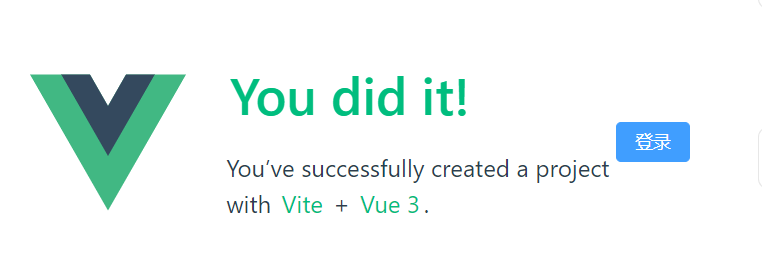

# 03.整合ElementPlus

## 1. 前言

由于我不擅长写前端的样式，经过多方考虑选择了使用人群较多的 `element-plus` 组件库，
想进一步了解，请参考官方文档： https://element-plus.org/zh-CN/

## 2. CSS 预处理器安装

主流的一些预处理器，像less、sass我都没有用过，对于我来讲都一样，由于 element-plus 使用的是 sass，所以我也选择 sass( •̀ ω •́ )✧。   详细了解参考官方地址:https://www.sass.hk/

## 3. 整合 element-plus

建议是按照官方文档来，文档很详细，懒人按照下面按顺序操作就行。

### 3.1. 安装依赖

```bash
npm install element-plus --save
```

### 3.2. 快速使用

官方推荐使用**自动导入**，其他方式参考官网 https://element-plus.org/zh-CN/guide/quickstart.html

```bash
npm install -D unplugin-vue-components unplugin-auto-import
```

#### 3.2.2.  修改 vite.config.ts

```typescript
// vite.config.ts
import { defineConfig } from 'vite'
import AutoImport from 'unplugin-auto-import/vite' // [!code ++]
import Components from 'unplugin-vue-components/vite' // [!code ++]
import { ElementPlusResolver } from 'unplugin-vue-components/resolvers' // [!code ++]

export default defineConfig({
  // ...
  plugins: [
    // ...
    AutoImport({ // [!code ++]
      resolvers: [ElementPlusResolver()], // [!code ++]
    }), // [!code ++]
    Components({ // [!code ++]
      resolvers: [ElementPlusResolver()], // [!code ++]
    }), // [!code ++]
  ],
})
```

#### 3.2.3.  测试一下

```vue
<!-- 在App.vue中测试  -->
<el-button type="primary" size="default" >登录</el-button>
```



正常显示，表示整合成功

