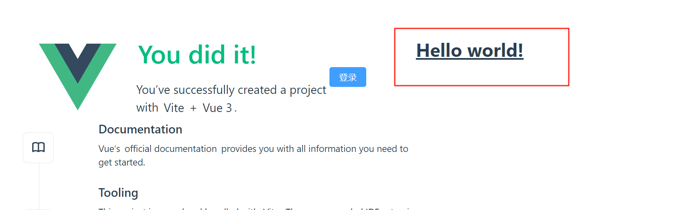

# 04.整合Tailwindcss

## 1. 前言

`tailwindcss` 是一个 `css` 框架，集成了很多封装好的 `css` 样式，我们只需要在标签上定义约定好的类名，就可以给元素添加相应的样式，十分方便。当然你也可以不使用，全部手撸。 官方文档：https://www.tailwindcss.cn

## 2. 整合

参考官方：https://www.tailwindcss.cn/docs/guides/vite#vue


- **安装**

```bash
npm install -D tailwindcss postcss autoprefixer
```

```bash
npx tailwindcss init -p
```

- **修改** **tailwind.config.js**

```js
/** @type {import('tailwindcss').Config} */
export default {
  content: [
    "./index.html",
    "./src/**/*.{vue,js,ts,jsx,tsx}",
  ],
  theme: {
    extend: {},
  },
  plugins: [],
}
```

- 添加样式指令集，新建 `./src/assets/index.scss`

```scss
@tailwind base;
@tailwind components;
@tailwind utilities;
```

- 在 `main.ts` 里引入

```typescript
import './assets/index.scss'
```

- **在`App.vue`中测试一下**

```vue
<h1 class="text-3xl font-bold underline">Hello world!</h1>
```




## 3. 解决指令提醒问题


:::tip

这里警告是因为，**vscode** 检测不到定义规则类型，在.vscode目录下，找到 settings.json, 没有就新建一个。

```json
{
    ...
   // 添加以下内容
  "scss.lint.unknownAtRules": "ignore"
}
```

:::
