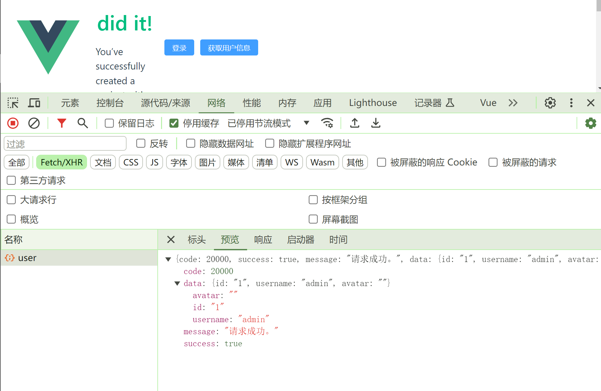
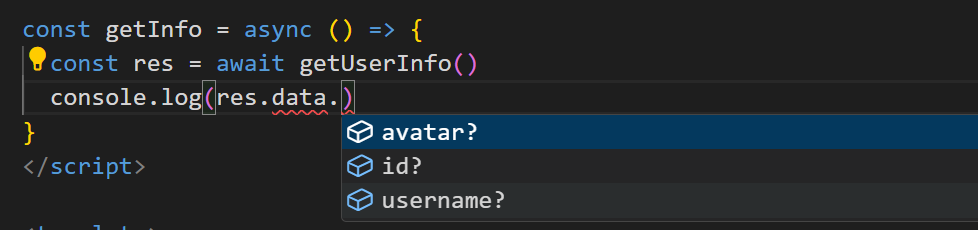
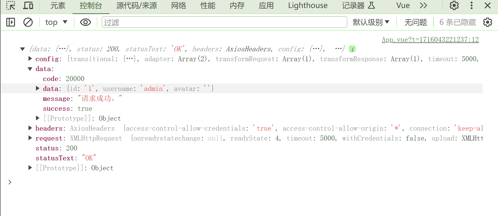
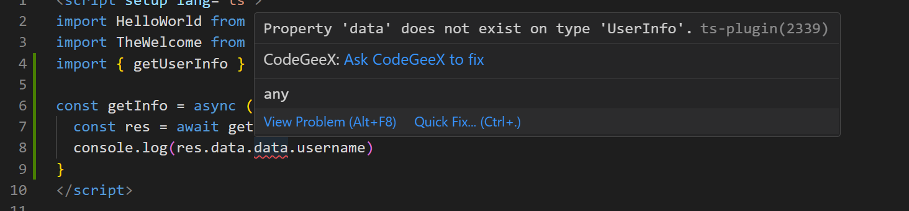
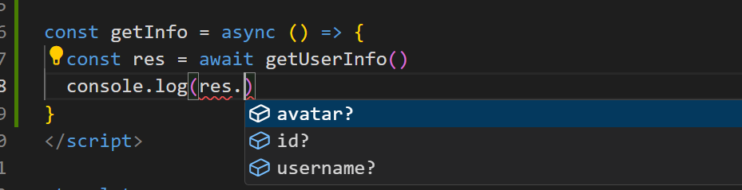
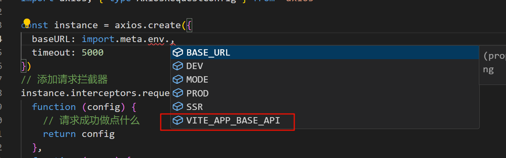
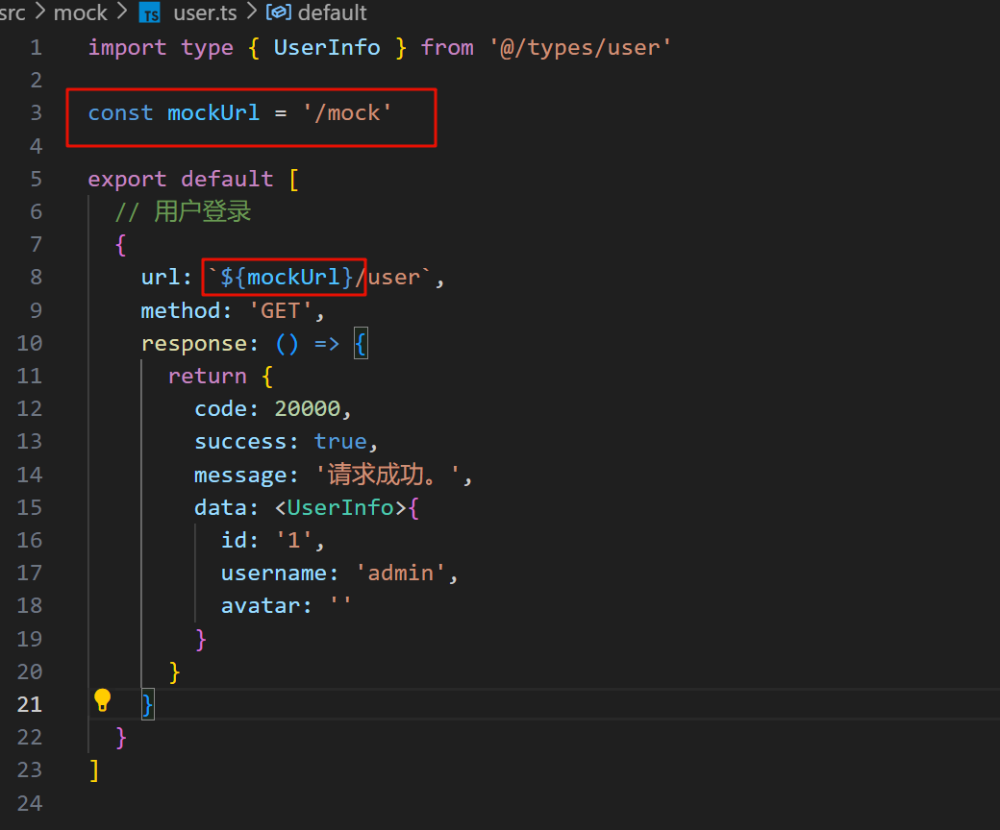

# 05.整合Axios + MockJs

## 1. 前言

作为前后端分离的项目，必不可少的当然是发请求向后端拿数据了， 但是不可能每次等到接口完成我们才开始开发前端，所以使用 `mock.js` 先模拟后端接口，等后端接口开发完成后，可以无缝衔接，直接替换为真正的后端服务。

## 2. 引入 Aioxs

:::info

Axios 是一个基于 promise 的网络请求库，进一步了解参考官方文档：[axios-http.com/zh/](https://axios-http.com/zh/)

:::

### 2.1. 安装依赖

```bash
npm install axios
```

### 2.2. 封装请求工具类

 新建目录 **src/utils**，新建文件 **request.ts**

```typescript
import axios from 'axios'

const instance = axios.create({
  baseURL: '/api',
  timeout: 5000
})
// 添加请求拦截器
instance.interceptors.request.use(
  function (config) {
    // 请求成功做点什么
    return config
  },
  function (error) {
    // 对请求错误做点什么
    return Promise.reject(error)
  }
)
// 添加响应拦截器
instance.interceptors.response.use(
  function (response) {
    // 对响应成功做点什么
    return response
  },
  function (error) {
    // 对响应错误做点什么
    return Promise.reject(error)
  }
)

export default instance

```

## 3. 整合 Mock.js + vite-plugin-mock

:::info

Mock.js 生成随机数据，拦截 Ajax 请求。进一步了解参考官方文档：[mockjs.com/](http://mockjs.com/)

**vite-plugin-mock**  这是一个插件，更方便的编写 `mock`接口， 文档地址：https://github.com/vbenjs/vite-plugin-mock/blob/main/README.zh_CN.md

:::

### 3.1. 安装依赖

```bash
npm i  mockjs vite-plugin-mock -D
```

### 3.2. vite.config.ts 配置

```typescript
// vite.config.ts
import { viteMockServe } from 'vite-plugin-mock' // [!code ++]

export default defineConfig({
  plugins: [
    vue(),
    // 添加 vite-plugin-mock 插件
    viteMockServe({ // [!code ++]
      // mock 数据文件所在的目录 // [!code ++]
      mockPath: './src/mock', // [!code ++]
      enable: true, // [!code ++]
      logger: true // [!code ++]
    }), // [!code ++]
  ]
})
```

### 3.3. 定义接口

新建文件夹 **src/api**，新建文件 **user.ts**

::: tip 类型定义

这里用的是 **ts** 所以对于类型要求比较严格，所以要定义好我们生成数据的类型 新建 **src/types** 文件夹，**data.d.ts** 中我定义了统一的一些类型，**user.d.ts** 则是用户相关的类型  

:::

```typescript
// data.d.ts 统一返回类型
export interface ApiRes<T> {
  success: boolean
  code: number
  data?: T
  message: string
}
```

```typescript
// user.d.ts
// 用户信息
export interface UserInfo {
  id?: string
  username?: string
  avatar?: string
}
```

**API接口定义**

```typescript
// api/user/index.ts
import type { UserInfo } from '@/types/user'

import request from '@/utils/request'
// 获取当前用户信息
export const getUserInfo = () => {
  return request<UserInfo>({
    method: 'GET',
    url: '/user'
  })
}
```

### 3.4. 新建 src/mock 目录，新建 user.ts

```typescript
import type { UserInfo } from '@/types/user'

export default [
  // 用户登录
  {
    url: '/api/user',
    method: 'GET',
    response: () => {
      return {
        code: 20000,
        success: true,
        message: '请求成功。',
        data: <UserInfo>{
          id: '1',
          username: 'admin',
          avatar: ''
        }
      }
    }
  }
]
```

### 3.5. 测试

-  在 **App.vue** 页面 加个 `button` 添加点击登录事件 

```vue
<script>
import { getUserInfo } from '@/api/user'

const getInfo = async () => {
  const res = await getUserInfo()
  console.log(res)
}
</script>
<template>
	<el-button type="primary" size="default" class="bg-green-500" @click="getInfo">获取用户信息</el-button>
</template>
```

- **启动项目**，点击测试



可以看到，如我们所预期的那样拿到了结果。那么后面想要什么数据自己定义好接口返回就行了。

## 4. 一点点优化

:::tip

我们想要拿到具体返回的内容，输入 **res.data.** 的时候由于 `ts` 类型检测给了我们提示，如果打印 **res.data.id** ,出来会是 **undefined**，因为从打印的 **res** 结果可以知道，其实我们要拿的数据应该在，**res.data.data** 里。

:::





我们改成 **res.data.data.id**，成功取到值了，但是这个时候会发现 **vscode** 爆红了，提示找不到类型



这里主要是因为，我们导出 **axios** 对象的时候，没有确定好类型，**vscode** 检测异常了, 而且在请求接口过程中，其实对于我们有用的信息就是最终的 **data** 对象，所以这里在封装的 **request.ts** 中，我们进行统一处理。  

### 4.1. 在响应拦截器中进行解构，返回 data 对象

```typescript
// 添加响应拦截器
instance.interceptors.response.use(
  function (response) {
    // 对响应成功做点什么
    const { success, message, data } = response.data
    if (success) {
      return data
    } else {
      // 请求失败，业务失败，消息提示
      return Promise.reject(new Error(message))
    }
  },
  function (error) {
    // 对响应错误做点什么
    return Promise.reject(error)
  }
)
```

### 4.2. 在导出 axios 对象的时候进行类型指定

```typescript
// 指定返回数据类型，类型推断提示
export default async <T = any>(config: AxiosRequestConfig) => {
  const response: T = await instance(config)
  return response
}
```


这个时候再去刚才测试的地方发现直接通过返回对象就可以有提示信息，并且可成功拿到返回结果。 如果发现没有提示或者爆红，重启一下 **vscode**。  




## 5. 环境切分

### 5.1. 创建 .env.development，注意这里的变量名必须以 VITE_ 开头

```properties
# 标志
ENV = 'development'

# base api
VITE_APP_BASE_API = '/mock'
```

### 5.2. 为我们自定义的变量添加类型扩展

```typescript
// env.d.ts
// 扩展环境变量
interface ImportMetaEnv {
    readonly VITE_APP_BASE_API: string
    // 更多环境变量...
  }
  
  interface ImportMeta {
    readonly env: ImportMetaEnv
 }
```

修改 `request.ts`中的 `baseURL`，这时可以看到有提示。  



修改 `mock.ts` 中定义的接口，将前缀改成 `/mock`


