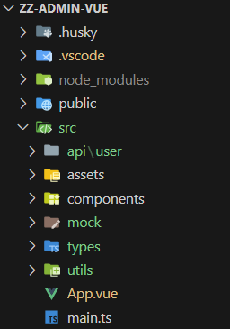
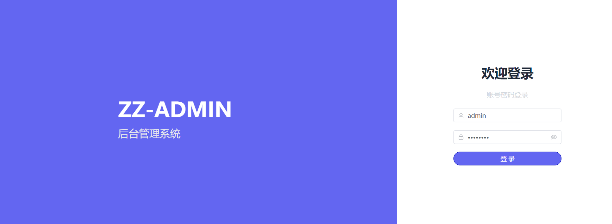

# 06. 登录页面开发

## 1. 前言

前面已经完成了一些基础的配置，接下来开始进入真正的开发阶段。开发过程中会涉及到一些其它插件的集成，这里用到什么就记录一下使用的心得体会。 

这里需要交代一下，项目里的文件命名规则，以及文件结构，`views`下存放所有业务相关的页面，根据不同逻辑，分为不同的文件夹，页面组件的命名方式为首字母大写驼峰式命名，并且必须为 `2` 个单词以上组成。比如我这里的登录页面，对应的就是 `views/login/LoginPage.vue`。我见过还有一种方式是通过文件夹区分逻辑，所有的页面都命名为 `index.vue`，这种方式就是 `views/login/index.vue`。我觉得这种方式不太好的地方在于，全部叫 `index.vue`，虽然组件名称短了，但是可读性较差。我更倾向于第一种，单词长点无所谓，清晰最重要。

## 2. 准备工作

- **删除所有自动生成的案例代码**
  - 删除 `src/components` 下所有文件
  - 删除 `App.vue` 所有组件，以及引用
  - 删除 `src/assets/base.css`、`src/assets/logo.svg`，并且删除`main.ts`对其的引用,

​	如果你按照我之前的文章一步步走到这里，文件目录结构应该如下图



## 3. 构建登录页面

### 3.1. 创建 `views/login/LoginPage.vue` 文件

```vue
<script setup lang="ts"></script>
<template>
  <div>登录页</div>
</template>
<style scoped lang="scss"></style>
```

### 3.2. 配置路由

**Vue Router** 是 **Vue** 的官方路由。它与 **Vue.js** 核心深度集成，让用 **Vue.js** 构建单页应用变得轻而易举。官方脚手架已经帮我们引入了，直接使用就可以了，详情参考官方文档：[router.vuejs.org](https://router.vuejs.org)

- **安装依赖**

```bash
npm install vue-router@4
```

- **创建路由**

  - 新建 `router/index.ts`

  - ```typescript
    import { createRouter, createWebHashHistory } from 'vue-router'
    import Login from '@/views/login/LoginPage.vue'
    
    const routes = [{ path: '/', name: 'login', component: Login }]
    
    const router = createRouter({
      history: createWebHashHistory(import.meta.env.BASE_URL),
      routes
    })
    
    export default router
    ```

- **注册插件**

```typescript
import './assets/index.scss'
import { createApp } from 'vue'
import App from './App.vue'
import router from './router/index' // [!code ++]

createApp(App)
    .use(router) // [!code ++]
    .mount('#app')
```

- **App.vue 内容全部删除，修改为下面内容**  

```vue
<script setup lang="ts">
  import { RouterView } from 'vue-router'
</script>
<template>
  <RouterView />
</template>
  <style scoped>
</style>
```

启动项目，访问可以看到进入了我们的登录页面。

## 4.  编写登录页面

因为是后台管理系统，所以对于样式要求不高，这个就不花太多时间琢磨了，如果想跟着做的直接复制我的就行。  **后续会用到一些图标，这里使用 element-plus 带的 ICON**

-  **下载依赖**  

```bash
npm install @element-plus/icons-vue
```

-  **修改 main.ts**

```typescript
// main.ts

// 如果您正在使用CDN引入，请删除下面一行。
import * as ElementPlusIconsVue from '@element-plus/icons-vue'

const app = createApp(App)
for (const [key, component] of Object.entries(ElementPlusIconsVue)) {
  app.component(key, component)
}
```


### 4.1. 创建登录用户对象

```typescript
// 登录用户对象
export interface LoginDto {
  username: string
  password: string
}
```

### 4.2. 页面样式编写

这里就是一些基础性代码，样式编写加一些表单数据绑定，校验等。 这里就不详细介绍了，所有代码可在代码仓库查看。

### 4.3. 请求获取信息

- **定义接口**

```typescript
/**
 * 登录
 * @param data LoginParam
 * @returns token
 */
export const login = (data: LoginDto) => {
  return request<string>({
    method: 'POST',
    url: '/login',
    data: { ...data }
  })
}
```


- **定义mock数据**

```typescript
// 定义类型
type Req<T> = {
  url: string
  body: T
  query: Record<string, never>
  headers: {
    [key: string]: string
    host: string
    connection: string
    origin: string
    'sec-fetch-site': string
    'sec-fetch-mode': string
    'sec-fetch-dest': string
    referer: string
    'accept-encoding': string
    'accept-language': string
  }
}

// mock接口
{
    url: `${mockUrl}/login`,
    method: 'POST',
    response: (req: Req<LoginDto>) => {
      const { username, password } = req.body
      if (username === 'admin' && password === 'admin123') {
        return {
          code: 20000,
          success: true,
          message: '请求成功。',
          data: '123safsfw35345241223'
        }
      } else {
        return {
          code: 50000,
          success: true,
          message: '用户名或密码错误。',
          data: {}
        }
      }
    }
  },
```


## 4. 调试



## 5. 总结

发现大量的代码使得文章变得很繁琐，写文章的时候很浪费时间，后面只记录重要流程和一些踩坑点，代码仓库直接开源了，原先想着因为会频繁的改动，等后面稳定了再开源的，所以开源的代码仅供参考，大家如果感兴趣可以看一下 https://gitee.com/cao-shen-yang/zz-admin-vue.git