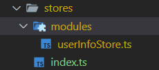
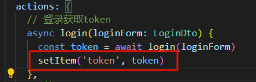
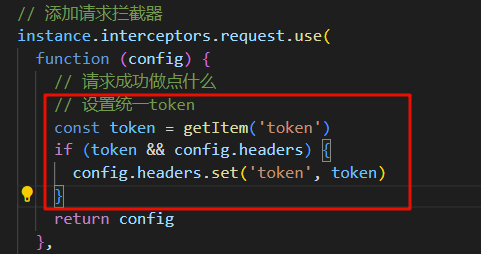
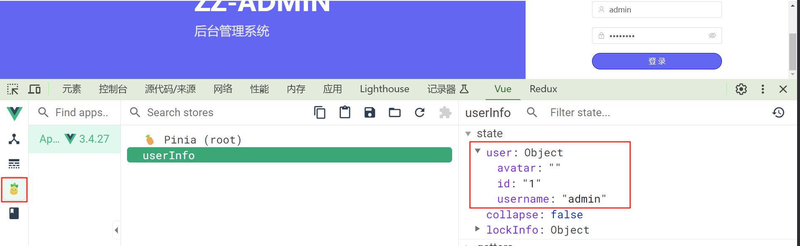
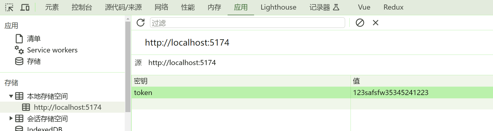
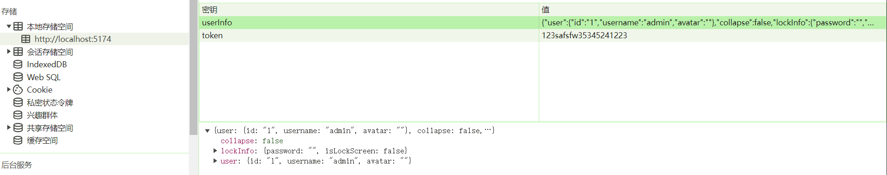

# 07.整合Pinia.md

## 1. 前言

**Pinia** 是 **Vue** 的专属状态管理库，它允许你跨组件或页面共享状态。更加契合 **VUE3** 组合式 **API** 和 **TS** 类型支持。想进一步了解，参考官网：https://pinia.vuejs.org/

 	如果是使用官方脚手架搭建的工程，选择了 pinia 将会自动帮我们整合好，没有选择也没关系，因为官方都是最简单的引入，实际使用还是要做一些调整的。对于我来说选择唯一的好处就是不用再 `npm install` 一下了。  

```bash
npm install pinia
```

## 2. 按模块化定义 store

整合好了之后这里要定义 `store`， 我理解的 `store` 就是一个全局的数据仓库，用来存放全局状态的数据，为了便于管理，这里我将按模块进行 `store` 的定义



- **创建 src/stores/index.ts**
- `main.ts` 里引入
- **modules**: 按模块定义对应的 **store**, **userInfoStore.ts** **表示用户相关数据存储的仓库**

::: info

**在引入 pinia 的时候做一些调整，不直接在 main.ts 里引入，这样做的好处在于，之后对于 pinia 集成一些插件，或者做一些其他配置，可以独立出来，不用全部堆积在 main.ts 中**

:::

### 2.1. 定义 store

```typescript
// userInfoStore.ts
import { defineStore } from 'pinia'

// 你可以对 `defineStore()` 的返回值进行任意命名，但最好使用 store 的名字，同时以 `use` 开头且以 `Store` 结尾。(比如 `useUserStore`，`useCartStore`，`useProductStore`)
// 第一个参数是你的应用中 Store 的唯一 ID。
export const useUserInfoStore = defineStore('userInfo', {
  // 其他配置...
})
```

### 2.2. **导出**

```typescript
import { createPinia } from 'pinia'

const store = createPinia()

export default store
```

### 2.3. **main.ts 中引入**

```typescript
//main.ts
...
// 引入 pinia
import store from './stores'

const app = createApp(App)
app.use(store)
...
```

## 3. 使用

```typescript
// LoginPage.vue
// 获取用户信息缓存仓库
const userInfo = useUserInfoStore()

// 处理登录方法
const handleLogin = async () => {
  // 表单验证
  const valid = await ruleFormRef.value?.validate()
  // 校验不成功直接 return
  if (!valid) {
    return false
  }
  // 校验成功进行后续操作
  // 1.加载 loading
  loading.value = true
  // 2.登录请求 获取token
  userInfo
    .login(loginData)
    .then(() => {
      // 跳转
      router.push('/')
    })
    .catch(() => {
      // 验证失败，做一些其他工作
    })
    .finally(() => {
      // 验证结束，隐藏loading
      loading.value = false
    })
}

```

**userStore处理**

```typescript
import { defineStore } from 'pinia'
import type { LoginData, UserInfo } from '@/types/user'
import { setItem } from '@/utils/storage'
import { TOKEN } from '../constant'
import { login, getUserInfo } from '@/api/user'
export const useUserInfoStore = defineStore('userInfo', {
  state: () => {
    // 用户信息
    return {
      user: {} as UserInfo
    }
  },
  actions: {
    // 登录获取token
    async login(loginForm: LoginData) {
      const token = await login(loginForm)
    },

    // 获取用户信息
    async getUserInfo() {
      this.user = await getUserInfo()
    }
  }
})

```

至此 `pinia` 可以正常拿到 `token` 了。但是不是最终想要的结果，正常逻辑应该是，请求获取 `token` ，将 `token` 放入本地缓存，再携带 `token` 获取用户信息，之后将用户信息缓存到 `pinia` 中。 接下来完成 `localStorage` 部分的编码 。

## 4. 编写 localStorage 工具类

 这里就不赘述了，看代码 ，主要就是操作 localStorage，新增，编辑，删除数据。

```typescript
//  localStoreage 工具类
/**
 * 存储数据
 * @param  key 键 
 * @param  value 值
 */
export const setItem = (key: string, value: any) => {
    // value 分为两种
    // 1.基础类型
    // 2.复杂类型
    if (typeof value === 'object') {
      value = JSON.stringify(value)
    }
    window.localStorage.setItem(key, value)
  }

 /**
 * 获取数据
 * @param key 键
 * @returns value
 */
export const getItem = (key: string): any => {
  try {
    const data = window.localStorage.getItem(key)
    return data != null ? JSON.parse(data) : null
  } catch (err) {
    return window.localStorage.getItem(key)
  }
}

  
  /**
   * 删除指定数据
   * @param key 键
   */
  export const removeItem = (key: string) => {
    window.localStorage.removeItem(key)
  }
  

  /**
   * 删除所有数据
   */
  export const removeAllItem = () => {
    window.localStorage.clear()
  }
  
```

- **在获取到 token 后保存**



- **请求时携带 token**



**便于测试，在请求完登录接口后，直接获取一下用户信息**

## 5. 测试

 登录成功之后可以看到 `pinia` 里存放的信息，前提是安装了 `vue devtools` 插件 



`localStorage` 里也有我们存放的 `token` 信息  



请求也自动带上了 `token`


## 6.  pinia持久化

在使用的时候发现 `pinia` 里存储的用户信息，刷新就没有了，其实这点也可以理解，因为是基于内存的，每个页面都有自己独立的 `JavaScript` 执行环境和内存空间。当一个页面被加载时，浏览器会为其创建一个全新的 `JavaScript` 上下文，包括内存空间、变量和对象。这意味着每个页面都有自己的数据存储，并且无法直接访问其他页面的内存空间。

此刻我有个疑惑是，使用 `pinia` 是不是必须要持久化呢？就比如存储用户基本信息这样的场景，如果不持久化就不满足我想要的效果，总不可能每次都去请求一下用户基础信息。那到底什么样的场景适合直接使用 `pinia`。

 我查阅了一些资料，最后得出了一个现阶段我对于 pinia 使用的一个认知。  

### 6.1. 不需要持久化的场景

 列举了几个我能想到的场景  

- **实时的数据展示**： 比如一个实时聊天页面，或者实时的绘制折线图的场景比如股票价格，这些数据只需要展示当前时刻，以及往后不断积累数据展示，保持当前页面最新，刷新后重新开始。
- **临时状态**：当我们操作页面时，前面的一些状态对于后续操作有影响，例如临时的表单数据或者选项选择，这些状态刷新后不需要保持不变
- **UI 状态**: 某些状态可能仅与用户界面相关，例如展开/折叠的面板、选项卡选择或滚动位置。这些状态通常不需要在重新加载应用程序时进行持久化。
- **临时错误状态**：临时错误状态：对于错误信息或警告信息，您可以在需要时存储在状态中，以向用户显示相应的提示。这些错误状态通常不需要在刷新页面时进行持久化。

### 6.2. 持久化场景

- **用户认证授权**：用户认证授权信息
- **用户个性化设置**：比如语言，主题偏好这些

### 6.3. 使用 pinia-plugin-persistedstate 持久化

之前我们使用的 `LocalStorage` 就是一种持久化方案，那么如何将 `pinia` 的存储也整合上去。 好在官方已经提供了现成的插件，我们直接使用就好，不必自己手动去 `setItem(token)` 了， 想进一步了解可参考官方文档。https://prazdevs.github.io/pinia-plugin-persistedstate/zh/guide/

- **安装依赖**

```bash
npm i pinia-plugin-persistedstate
```

- **将插件添加到 pinia 实例上**

```typescript
./stores/index.ts
import { createPinia } from 'pinia'
import piniaPluginPersistedstate from 'pinia-plugin-persistedstate'

const store = createPinia()

store.use(piniaPluginPersistedstate)

export default store
```

- **在需要持久化的 store 里开启持久化**

```typescript
import { defineStore } from 'pinia'
import type { LoginData, UserInfo } from '@/types/user'
import { setItem } from '@/utils/storage'
import { TOKEN } from '../constant'
import { login, getUserInfo } from '@/api/user'

export const useUserInfoStore = defineStore('userInfo', {
  state: () => {
    // 用户信息
    return {
      user: {} as UserInfo
    }
  },

  actions: {
    // 登录获取token
    async login(loginForm: LoginData) {
      const token = await login(loginForm)
      setItem(TOKEN, token)
    },

    // 获取用户信息
    async getUserInfo() {
      this.user = await getUserInfo()
    }
  },
  persist: true  // [!code ++]
})
```

- **测试**

登录成功后刷新，数据不会丢失了，并且可以看到存储在了`localStorage`里



:::tip

 这里持久化的配置是可以设置的，据我大致了解，存进的 `key` 值默认取得是 `store` 定义的 `name`，默认的是 `localStorage` 存储，可以换成其他，具体看这里：  https://prazdevs.github.io/pinia-plugin-persistedstate/zh/guide/config.html

:::