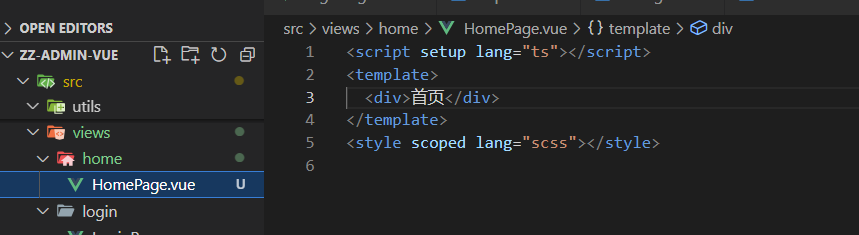
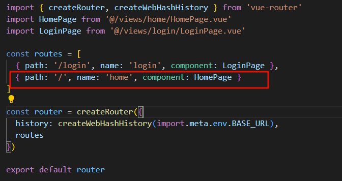
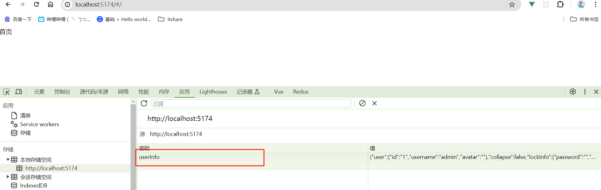
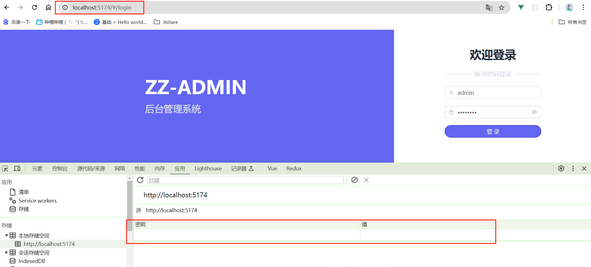
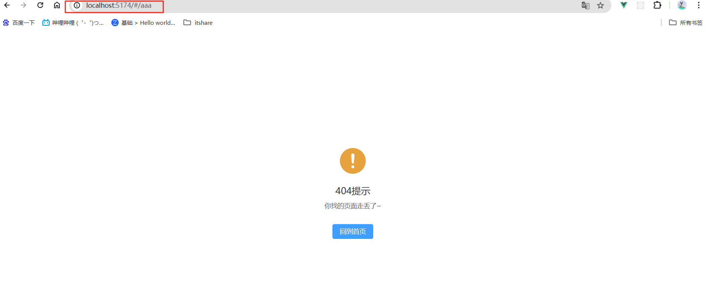

# 08. 登录鉴权

## 1. 前言

首先要明确什么是登录鉴权：  

- 在登录成功之后，会跳转到后台页面，用户未登录的情况下输入 `/login` 之外的其他页面，提示未登录。
- 用户登录后，`token` 过期之前都不允许进入 login 页面，重复登录。

这里使用 **路由守卫** 来实现这个功能，在配置之前先引入一个进度条组件，优化一下操作体验

## 2. 引入 NProgress 进度条组件

:::info

 想要进一步了解，参考官方文档： https://rstacruz.github.io/nprogress/

:::

### 1.1. 安装依赖

```bash
npm install --save nprogress
```

### 1.2. 新建 src/plugins/nprogress.ts 进度条配置文件

```typescript
import nprogress from 'nprogress'
import 'nprogress/nprogress.css'

// 全局进度条配置
nprogress.configure({
  easing: 'ease', // 动画方式
  speed: 500, // 递增进度条速度
  showSpinner: false, // 是否现实加载ico
  trickleSpeed: 400, // 自动递增间隔
  minimum: 0.3 // 初始化时最小百分比
})

export default nprogress
```

:::tip

**TIPS：这个时候，可能会爆红，这是因为TS类型检测的原因，安装一下类型支持，重新打开一下这个配置文件应该就可以了**

```bash
npm i --save-dev @types/nprogress
```

:::

## 2. 配置路由守卫

在 `src` 下新建 `permission.ts`, 并在 `main.ts` 中引入。代码我就不贴出来了, 源码在这里查看：

https://gitee.com/cao-shen-yang/zz-admin-vue/blob/master/src/permission.ts


## 3.  便于测试添加了首页路由  

- **添加页面组件**




- **添加路由**



## 4. 测试

- **token存在时，可正常访问首页**



- **我们手动删除缓存，刷新一下，自动跳转到登录页了**




## 5. 配置异常页面

### 5.1. 新建 view/errors/NotFountPage.vue

```vue
<script setup lang="ts">
import router from '@/router'
</script>
<template>
  <div class="h-screen flex justify-center items-center">
    <el-result icon="warning" title="404提示" sub-title="你找的页面走丢了~">
      <template #extra>
        <el-button type="primary" @click="router.push('/')">回到首页</el-button>
      </template>
    </el-result>
  </div>
</template>
<style scoped lang="scss"></style>
```

### 5.2. 配置 404 路由

```typescript
// router/index.ts
import NotFound from '@/views/errors/NotFoundPage.vue'
...
routes: [
   ...
    {
      path: '/:pathMatch(.*)*',
      component: NotFound,
      name: 'NotFound'
    }
  ]

```

**随便访问一个没有定义的路径**

