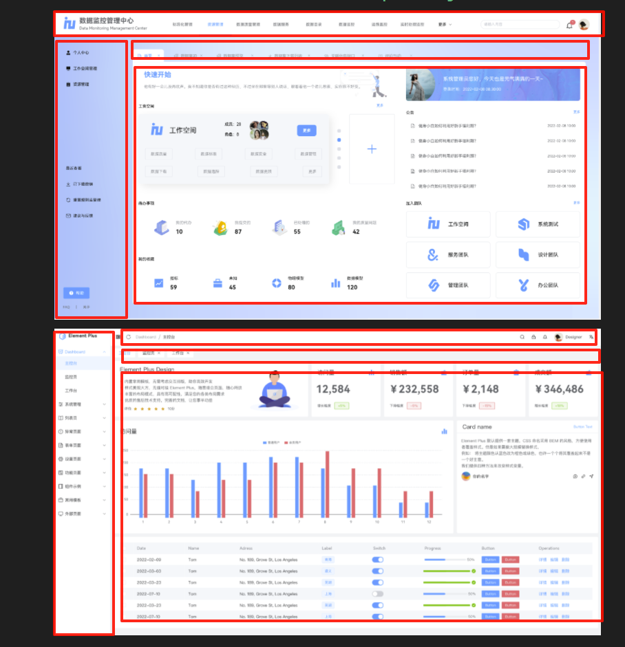
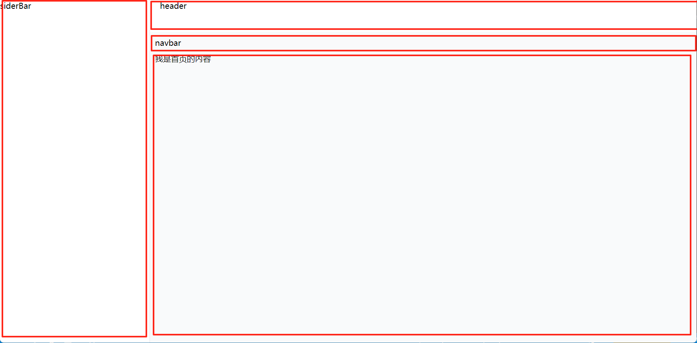
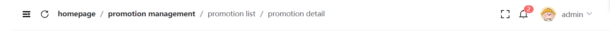
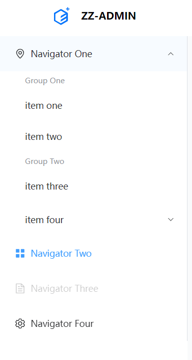
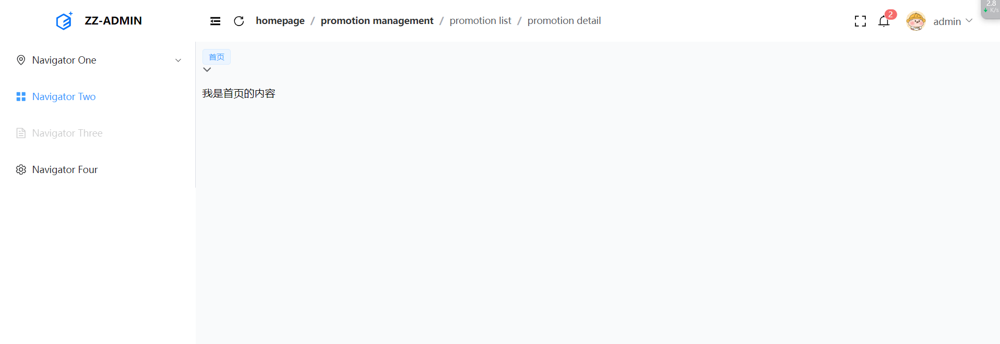

# 09. 布局

## 1. 前言

为了稍微好看点在网上扒了个图，感兴趣可以自己去这里找一个 https://mastergo.com/





两种布局都其实很相似，但是有一点点的区别，先按照第二种完成，后续可以做多主题切换

具体实现就不赘述了，可以直接在代码仓库查看。

## 2. 布局开发

- 新建 `/src/layout` 文件夹
- 配置路由

```typescript
const routes = [
  { path: '/login', name: 'login', component: LoginPage },
  {
    path: '/',
    redirect: '/home',
    component: MyLayout,
    children: [{ path: '/home', name: 'home', component: HomePage }]
  },
  { path: '/:pathMatch(.*)*', component: NotFountPage, name: 'NotFound' }
]
```

:::info

调整一下路由组织方式，所有其他模块路由都为`layout`的子路由，页面输出为`content`区域内部

:::

- 配置路由出口

```vue
<script setup lang="ts"></script>
<template>
  <div class="app-layout">
    <el-container>
      <el-aside class="app-sider-bar"> siderBar </el-aside>
      <el-container>
        <el-header class="app-header"> header </el-header>
        <el-main class="app-main">
          <div class="app-lab-nav">navbar</div>
          <div class="app-page">
            <RouterView />
          </div>
        </el-main>
      </el-container>
    </el-container>
  </div>
</template>
<style scoped lang="scss"></style>
```



这样就得到了我们想要的布局结构，接下来完善每个区域的功能就可以了。


## 3. 头部组件

`vue` 的一大特点，组件式开发，按照划分，开发每个组件，最后合到一起就成了。

:::warning

这里在调试样式的时候发现，总是和预想的有出入，这个是因为浏览器默认样式有干扰，使用 `reset.css` 初始化一下,可在官网获取 http://meyerweb.com/eric/tools/css/reset/

:::

将所有和布局有关的组件都放在 `/layout/components` 下

- **新建 AppHeader.vue**
- **编码（这里我只列出编码的过程，具体实现看源码）**
  - 定义`header`容器，设置样式宽度
  - 对照设计图，头部大致分为两个区域，使用 `flex` 布局，左边面包屑，右边功能按钮
  - 完善左边区域，添加菜单折叠按钮，通过全局状态管理折叠状态 `collapse`
  - 完善左边区域，添加刷新菜单按钮
  - 完善左边区域，添加面包屑，抽离出去，自定义组件，这个后面需要和路由相关联，先写静态数据
  - 完善右边区域，添加全屏展示按钮，使用 `vueuse` 提供的 `hooks` `useFullscreen()` 实现
  - 完善右边区域，添加提醒的铃铛🔔
  - 完善右边区域，添加头像，名称，下拉菜单
  - 添加默认头像，当没有获取到头像时使用默认头像，在 `store` 里写逻辑进行处理




## 4. 侧边菜单栏组件

- **新建 AppMenu.vue**

- **编码（这里我只列出编码的过程，具体实现看源码）**
  - 添加一个静态的菜单组件数据


## 5. logo 组件开发

- **新建 AppLogo.vue**

- **编码 **

```vue
<script setup lang="ts">
import { useUserInfoStore } from '@/stores/modules/userInfoStore'

const userStore = useUserInfoStore()
</script>
<template>
  <div class="logo">
    <el-icon :size="32" color="#0473fb"><ElementPlus /></el-icon>
    <span v-if="!userStore.collapse" class="font-bold text-black text-nowrap">ZZ-ADMIN</span>
  </div>
</template>
<style scoped lang="scss">
.logo {
  @apply flex justify-center items-center space-x-4 py-4;
}
</style>

```





## 6. 标签导航栏

- **新建 AppLabelNav.vue**

- **编码 **

```vue
<script setup lang="ts">
/***************************** 数据源 ******************************************/
/***************************** 方法区 ******************************************/
// 关闭其它 全部关闭
const handleClose = (command: string) => {
  switch (command) {
    case 'clearOther':
      break
    case 'clearAll':
      break
    default:
      break
  }
}
</script>
<template>
  <div class="app-label-nav">
    <div class="tags-item">
      <el-tag> 首页 </el-tag>
    </div>
    <span class="tag-btn">
      <el-dropdown @command="handleClose">
        <span>
          <el-icon><ArrowDownBold /></el-icon>
        </span>
        <template #dropdown>
          <el-dropdown-menu>
            <el-dropdown-item command="clearOther">关闭其他</el-dropdown-item>
            <el-dropdown-item command="clearAll">全部关闭</el-dropdown-item>
          </el-dropdown-menu>
        </template>
      </el-dropdown>
    </span>
  </div>
</template>
<style scoped lang="scss"></style>

```

最终完成效果大概是这样的


