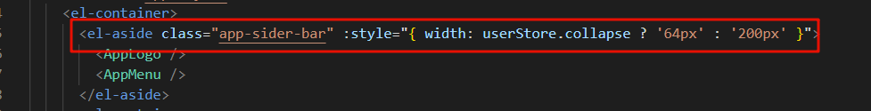
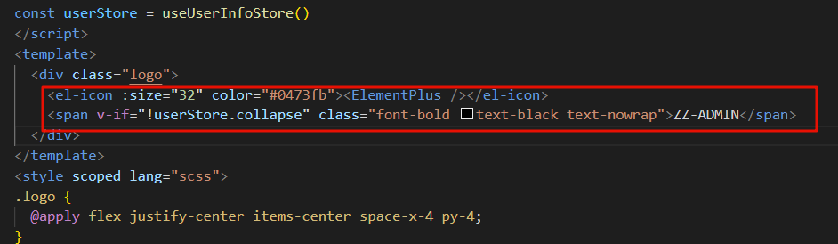
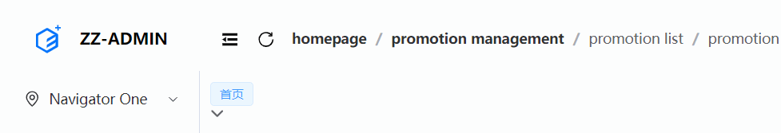
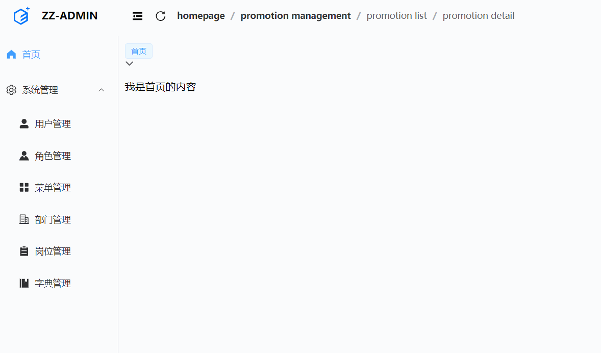

# 10. 功能完善

## 1. 前言

前面我们完成了一个简单的后台管理系统的布局，但是都是假数据，接下来我们改成 `mock` 接口，完成真正的业务开发。

## 2. 菜单展示

使用组件库中的menu组件，很容易就可以实现一个菜单栏，但是想要达到我们理想中的菜单，还需要一点点改动，在这个过程中我碰到了以下几个问题：

- **菜单 logo 与名称，在菜单收缩展开时的显示与隐藏**

- **动态显示菜单以及处理多级菜单**

## 3. 菜单logo区域处理

首先是将侧边栏分成2部分，上部显示 `logo`, 下部显示菜单，大致思路就是，当菜单收缩折叠时，动态控制这个区域的宽度，并且加上动画，使这个过程更加平滑



在 `logo` 部分收缩的时候，只显示`logo`, 将名称隐藏，这个使用一样的思想



这里具体可以参考源码



## 4. 动态获取菜单数据

:::info

涉及到这种多级嵌套的情况，首先想到的就是递归，所以我们可以定义一个菜单组件，递归显示

新建 src/components/menu/RecursiveMenu.vue，主要思路就是接收一个菜单树数据，然后进行处理，当有子节点的时候使用 `<el-sub-menu>`,并且在处理完后进行递归，处理孙子节点， 没有子级菜单的时候直接使用 `<el-menu-item>`

:::


- **准备mock数据**

在`mock`文件夹下新增 `data`目录，后面所有的静态数据都放在这

定义用户的基础数据

```json
{
  "id": "1",
  "username": "admin",
  "avatar": null,
  "menus": [
    {
      "menuId": 1,
      "name": "System",
      "path": "/system",
      "component": "Layout",
      "icon": "Setting",
      "title": "系统管理",
      "children": [
        {
          "menuId": 2,
          "component": "system/user/UserManagementPage.vue",
          "icon": "UserFilled",
          "title": "用户管理",
          "name": "User",
          "path": "/user",
          "children": []
        },
        {
          "menuId": 3,
          "component": "system/role/RoleManagementPage.vue",
          "hidden": false,
          "icon": "Avatar",
          "title": "角色管理",
          "name": "Role",
          "path": "/role"
        },
        {
          "menuId": 4,
          "component": "system/menu/MenuManagementPage.vue",
          "hidden": false,
          "icon": "Menu",
          "title": "菜单管理",
          "name": "Menu",
          "path": "/menu"
        },
        {
          "menuId": 5,
          "component": "system/dept/DeptManagementPage.vue",
          "hidden": false,
          "icon": "OfficeBuilding",
          "title": "部门管理",
          "name": "Dept",
          "path": "/dept"
        },
        {
          "menuId": 6,
          "component": "system/post/PostManagementPage.vue",
          "hidden": false,
          "icon": "List",
          "title": "岗位管理",
          "name": "Job",
          "path": "/post"
        },
        {
          "menuId": 7,
          "component": "system/dict/DictManagementPage.vue",
          "hidden": false,
          "icon": "Management",
          "title": "字典管理",
          "name": "Dict",
          "path": "/dict"
        }
      ]
    }
  ]
}

```

- 编写`mock`接口

:::tip

调整了一下代码结构，将每个接口抽取出去，再导出

:::

```typescript
import type { LoginDto } from '@/types/user'
import userInfo from './data/userInfo.json'

const mockUrl = '/mock'

type Req<T> = {
  url: string
  body: T
  query: Record<string, never>
  headers: {
    [key: string]: string
    host: string
    connection: string
    origin: string
    'sec-fetch-site': string
    'sec-fetch-mode': string
    'sec-fetch-dest': string
    referer: string
    'accept-encoding': string
    'accept-language': string
  }
}

// 登录
const login = {
  url: `${mockUrl}/login`,
  method: 'POST',
  response: (req: Req<LoginDto>) => {
    const { username, password } = req.body
    if (username === 'admin' && password === 'admin123') {
      return {
        code: 20000,
        success: true,
        message: '请求成功。',
        data: '12335345241223'
      }
    } else {
      return {
        code: 50000,
        success: true,
        message: '用户名或密码错误。',
        data: {}
      }
    }
  }
}

const getUserInfo = {
  url: `${mockUrl}/user`,
  method: 'GET',
  response: (req: Req<any>) => {
    const token = req.headers.token

    if (token !== '12335345241223') {
      return {
        code: 50000,
        success: false,
        message: 'token验证错误',
        data: {}
      }
    }
    return {
      code: 20000,
      success: true,
      message: '请求成功。',
      data: userInfo
    }
  }
}

export default [login, getUserInfo]

```

- **修改登录逻辑**

在我们添加路由守卫时候，我们做了调整，如果缓存中没有用户信息，就会去获取当前用户的信息，然后将用户信息存储在缓存中。

为了严谨，`UserInfo` 类型加上 `menu` 菜单的类型

```typescript
export interface UserInfo {
  id?: string
  username?: string
  avatar?: string
  menus?: [MenuItem]
}
export interface MenuItem {
  menuId: number
  name: string
  icon: string
  path: string
  component: string
  hidden: boolean
  title: string
  children?: MenuItem[]
}
```

这样我们就拿到了菜单列表的动态数据，接下来将原先的静态数据替换掉

```vue
<script setup lang="ts">
import RecursiveMenu from '@/components/menu/RecursiveMenu.vue'
import router from '@/router'
import { useUserInfoStore } from '@/stores/modules/userInfoStore'
import { ref } from 'vue'
import { onBeforeRouteUpdate, useRoute } from 'vue-router'

/***************************** 数据源 ******************************************/

const userStore = useUserInfoStore()
const menus = userStore.user.menus
const route = useRoute()
// 默认选中
const defaultActive = ref(route.path)
/***************************** 方法区 ******************************************/

// 监听路由变化
onBeforeRouteUpdate((to) => {
  defaultActive.value = to.path
})
const handleSelect = (e: any) => {
  router.push(e)
}
</script>
<template>
  <el-menu
    :default-active="defaultActive"
    @select="handleSelect"
    :unique-opened="true"
    class="side-menu"
    :collapse="userStore.collapse"
  >
    <el-menu-item index="/home">
      <el-icon><HomeFilled /></el-icon>
      <span> 首页 </span>
    </el-menu-item>
    <RecursiveMenu :menu-data="menus" />
  </el-menu>
</template>
<style scoped lang="scss">
.side-menu:not(.el-menu--collapse) {
  @apply w-[200px];
}
.side-menu {
  @apply grow overflow-x-hidden;
}
</style>

```

为了支持多级菜单，这里使用了递归，定义一个 `RecursiveMenu.vue` 组件

```vue
<script setup lang="ts">
import type { MenuItem } from '@/types/user'

import { type PropType } from 'vue'
import RecursiveMenu from './RecursiveMenu.vue'

defineProps({
  menuData: { type: Array as PropType<MenuItem[]>, require: true }
})
</script>
<template>
  <template v-for="menuItem in menuData" :key="menuItem.menuId">
    <!-- 有子级菜单的时候  el-sub-menu-->
    <el-sub-menu :index="menuItem.path" v-if="menuItem.children && menuItem.children.length > 0">
      <template #title>
        <el-icon>
          <component :is="menuItem.icon"></component>
        </el-icon>
        <span>{{ menuItem.title }}</span>
      </template>
      <RecursiveMenu :menuData="menuItem.children" />
    </el-sub-menu>
    <!-- 没有子级菜单的时候  el-menu-item -->
    <el-menu-item v-else :index="menuItem.path">
      <el-icon>
        <component :is="menuItem.icon"></component>
      </el-icon>
      <span>{{ menuItem.title }}</span>
    </el-menu-item>
  </template>
</template>
<style scoped lang="scss"></style>
```

这里的首页，我是直接写死的，默认所有用户都拥有，避免新用户进入后一片空白



这时候就能看到正确显示了

