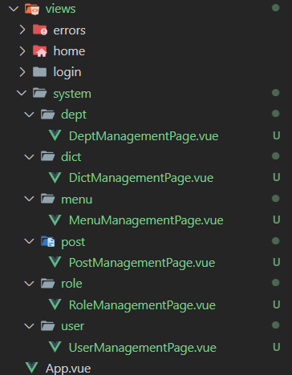
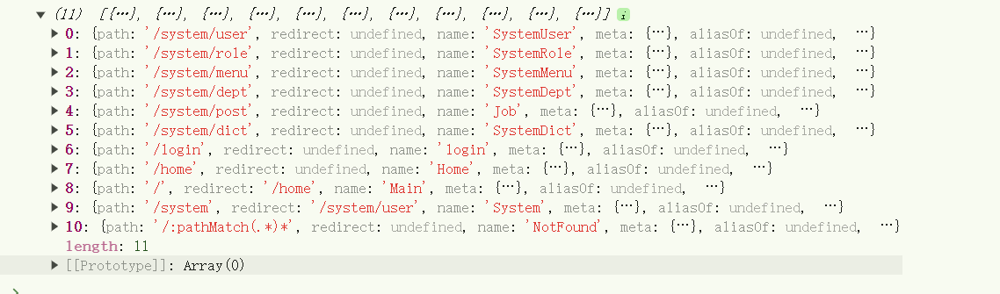

# 11. 动态路由

## 1. 创建组件

为了方便后面测试，我们先将菜单下的所有页面创建出来




根据后台返回的菜单数据，组装成动态路由核心方法就是 `router.addRoute()`，更详细介绍参照官方文档：https://router.vuejs.org/zh/guide/advanced/dynamic-routing.html

##  2. 实现动态路由准备

实现思路大致就是，我们通过后端拿到数据，然后经过`二手`加工，最后插入到我们的路由表中，需要注意的就是插入的时机，以及刷新后不丢失的问题。

为了解决刷新的问题，通常做法是放在路由守卫里去保持，避免频繁无效的组织路由表，还会弄一个标记位来优化，避免重复请求，会将路由信息放在缓存中，提高效率。

接下来我们就按照这个思路来实现动态路由

首先路由分为两个部分，**静态路由** 和 **动态路由**

静态路由很好理解，就是一些公共的路由，所有用户默认拥有的

动态路由则是通过后端权限控制，返回给前端的，每个人都不一样

### 2.1 **静态路由定义**

```typescript
import { createRouter, createWebHashHistory, type RouteRecordRaw } from 'vue-router'
import HomePage from '@/views/home/HomePage.vue'
import LoginPage from '@/views/login/LoginPage.vue'
import NotFountPage from '@/views/errors/NotFountPage.vue'
import MyLayout from '@/layout/MyLayout.vue'

/** 静态路由，所有用户默认拥有的菜单路由 */
const staticRoutes: Array<RouteRecordRaw> = [
  { path: '/login', name: 'login', component: LoginPage },
  { path: '/:pathMatch(.*)*', component: NotFountPage, name: 'NotFound' },
  {
    path: '/',
    name: 'Home',
    redirect: '/home',
    component: MyLayout,
    children: [
      {
        path: '/home',
        name: 'Home',
        component: HomePage,
        meta: { title: '首页', icon: 'dashboard', hidden: false }
      }
    ]
  }
]

const router = createRouter({
  history: createWebHashHistory(import.meta.env.BASE_URL),
  routes: staticRoutes
})

export default router
```

### 2.2 定义接口准备mock数据

- 登录成功后获取用户信息里的，菜单数据就是我们的目标数据


## 3. 组装路由

当登录成功后，路由跳转，携带`token`请求用户信息，并且储存在缓存中

 ```typescript
 // 添加动态路由
     async setAsyncRoutes() {
       console.log('11', this.user.menus)
 
       // 添加动态路由
       if (!this.user || !this.user.menus) return
 
       const routerList = transformToRoutes(this.user.menus)
       routerList.forEach((route) => {
         router.addRoute('Main', route)
       })
       // 可能需要等待路由更新完成
       router.isReady()
     }
 ```

```typescript
import type { MenuItem } from '@/types/user'
import type { RouteRecordRaw } from 'vue-router'

/**
 * 将菜单转成路由信息
 * @param menus
 */
export function transformToRoutes(menus: MenuItem[]): RouteRecordRaw[] {
  return menus.flatMap((item): RouteRecordRaw[] => {
    // 没有子级菜单
    if (!item.children || item.children.length === 0) {
      return [
        {
          path: item.path,
          name: item.name.replace(/\s/g, ''),
          component: () => import(/* @vite-ignore */ '../views/' + item.component),
          meta: { title: item.title }
        }
      ]
    } else {
      return [
        {
          path: item.path || '/', // 如果顶级菜单没有path，可设置为'/'
          name: item.name.replace(/\s/g, ''),
          redirect: `${item.children[0].path}`,
          meta: { title: item.title },
          children: transformToRoutes(item.children)
        }
      ]
    }
  })
}

```




