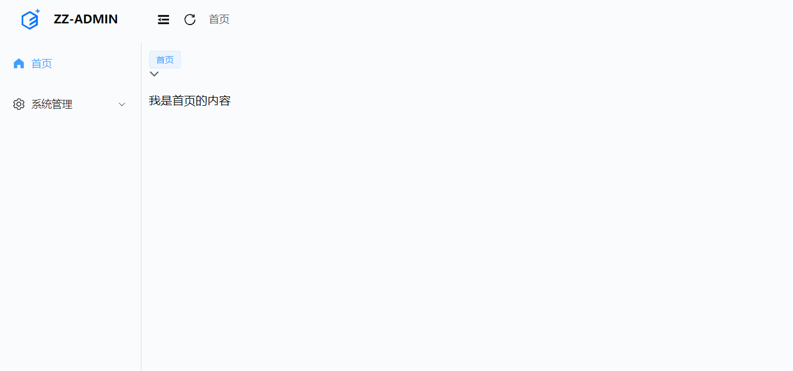
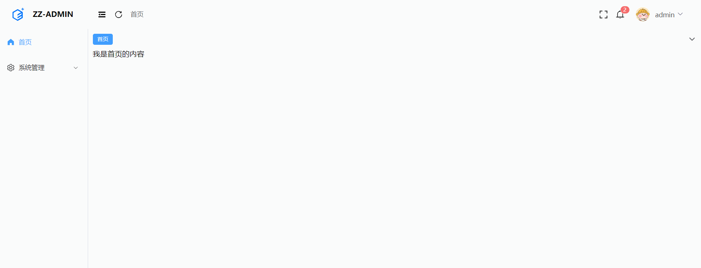

# 12. 面包屑和标签导航

## 1. 前言

前面我们已经实现了动态菜单展示，动态路由生成，一个基础的管理模板已经初步完成，如果是一些简单的项目，接下来就可以针对每个页面编写业务代码了，但是我们添加了面包屑和标签导航，接下来我们来完善它。

## 2. 面包屑

- **显示当前页面的路径，快速返回之前的任意页面。**

代码见源码仓库



## 3. 标签导航

- 解决单页面应用没法多页面切换操作的痛点
- 优化使用体验
- 需要有记忆功能，所以我们需要将当前打开的标签数据存入缓存中

```typescript
 export interface NavTab {
  title: string
  path: string
}
 
 tabList: [{ title: '首页', path: '/home' }] as NavTab[],
```



具体实现看源码仓库，备注写的很清楚


## 4. 添加 keepalive 和页面切换动画

```vue
<RouterView v-slot="{ Component }">
    <transition name="fade">
        <KeepAlive :max="10">
            <component :is="Component"></component>
        </KeepAlive>
    </transition>
</RouterView>

```

```scss
.fade-enter-from,
.fade-leave-to {
  opacity: 0;
}

.fade-enter-to,
.fade-leave-from {
  opacity: 1;
}

.fade-enter-active,
.fade-leave-active {
  transition: all 0.3s;
}

.fade-enter-active {
  transition-delay: 0.3s;
}
```

