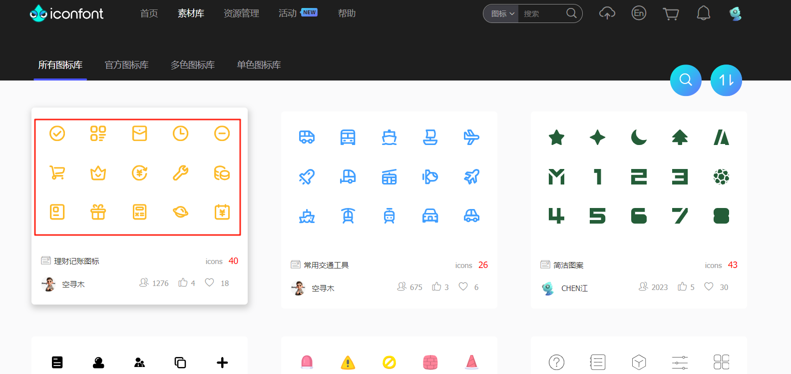
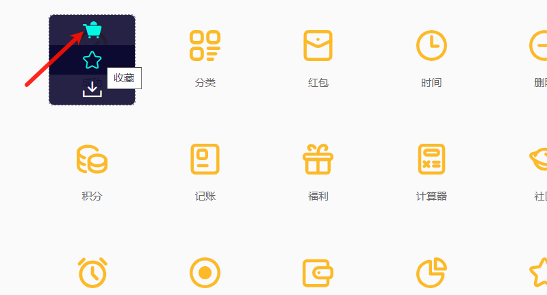
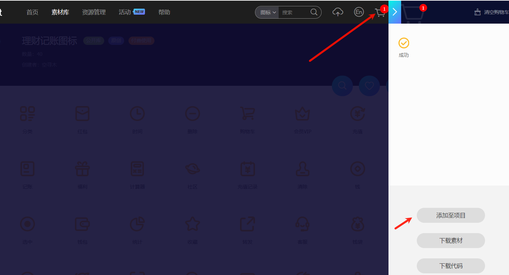
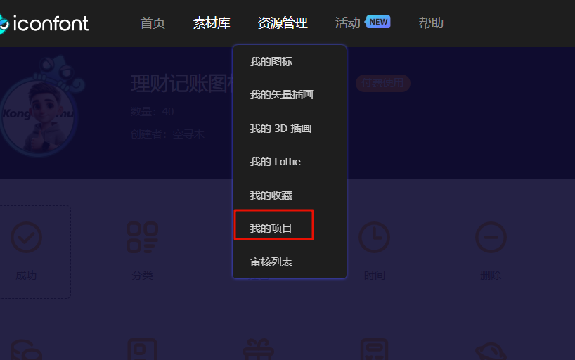
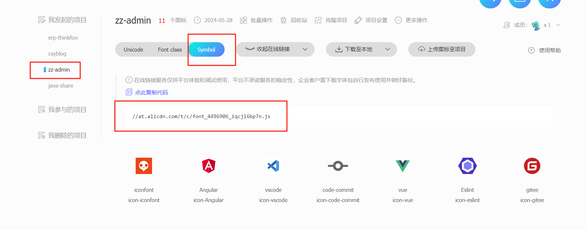

# 13. SVG 图标使用

## 1. 前言

百度搜一下，各种五花八门的方案，各种封装，兼容各个平台，但我想说的是，这只是个基础的小功能，没必要这么折腾，简单快速方便就行。

我使用 `iconfont` 作为图标库，简单说就是，看中哪个加把哪个加入收藏，最后生成一个外部引入的 `js`，然后就可以在项目中使用了，就这么简单。当然你也可以把它们下载下来放到项目中，作为静态资源。

为了方便对颜色，大小控制，不用到处写，再给它包一层。


## 2. 找图标




找到喜欢的加入购物车




然后将购物车内所有的添加到项目中，没有可以新建一个




在**资源管理**中找到**我的项目**




选中自己的项目，然后选择 `Symbol`, 生成代码




将代码复制下来，引入项目，直接添加到 `index.html` 就行

```js
 <script src="https://at.alicdn.com/t/c/font_4496906_qsf0nsdo6pq.js"></script>
```

## 3. 封装 Svg 组件

- **新建 src/components/SvgIcon.vue**

- **编写代码**

```vue
<!-- src/components/Icon.vue -->
<script setup lang="ts">
const props = defineProps({
  iconName: { type: String, required: true },
  color: { type: String, default: '#000' },
  size: { type: Number, default: 20 }
})
</script>

<template>
  <svg class="icon" aria-hidden="true" :font-size="props.size" :color="props.color">
    <use :xlink:href="`#${props.iconName}`"></use>
  </svg>
</template>

<style scoped>
/* 如果需要对图标进行额外样式调整，可以在此处添加 */
.icon {
  width: 1em;
  height: 1em;
  vertical-align: -0.15em;
  fill: currentColor;
  overflow: hidden;
}
</style>

```

- **使用**

```vue
<SvgIcon :icon-name="logo" :size="60" :color="color"></SvgIcon>
```

:::warning

这里有个小坑，有的时候会发现我们通过这种`Symbol`方式引入的图标，无法修改颜色，这个是由于我们加入的图标是彩色图标，`svg` 在引入的时候已经通过 `fill=""` 填充了颜色，所以要想支持改色，只能改那种单色的。

或者我们把源码下下来，改 `fill`，其实不是大问题，了解一下就行。

:::


## 4. 总结

另外提一嘴，这种在线引入的方式依赖于网络，如果断网，或者 iconfont 的网址挂了，可能就加载不到了，所以平时开发的时候因为会频繁改动所以用在线的，等到项目稳定，还是要把资源拉到本地，避免图标无法访问