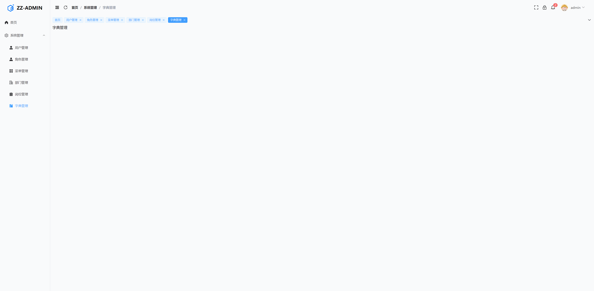

# 14. 锁屏功能开发

## 1. 前言

在正式的业务开发前，我们先来写一个小需求，练练手。

业务场景是，为系统加上一个锁屏的功能，当我们离开的时候可以对系统进行锁屏，避免敏感信息泄露。

我们要实现的效果就是，点击锁屏，提示输入一个临时的密码，然后系统锁定，点击解锁，输入密码解锁。


## 2. 实现锁屏

其实比较简单的实现就是我们定义一个对话框，点击锁定，对话框弹出，输入临时密码，解锁对话框关闭，这个对话框覆盖整个屏幕

**实现对话框**

- 定义组件 Dialog 组件
- 为了方便控制 Dialog 的状态，我用了pinia管理
- 定义锁屏的类型 `lockInfo: { password: '', isLockScreen: false } as LockInfo`
- 点击锁定按钮的时候，设置密码和状态，并且存入缓存

- 之后只要在 `AppHeader` 组件中引用，通过按钮控制唤起，关闭就可以了

**实现锁屏界面**

- 这个就是一个撑满整个屏幕的页面，样式可以自行发挥，我是找了一个网站抄的😄
- 引入 `day.js` 对时间进行格式化 https://dayjs.fenxianglu.cn/

```bash
npm install dayjs
```

- 引入 `gsap` 进行动画控制

https://gsap.framer.wiki/stated 中文站点
https://gsap.com/docs/v3/GSAP/ 官网

```bash
npm install gsap
```


:::error

这里有个报错，ts 类型检测报错 Cannot find name 'ElMessageBox'.ts(2304)

**解决方法**：tsconfig.app.json 里添加自动导入类型 auto-imports.d.ts

:::




